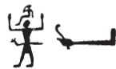
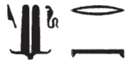
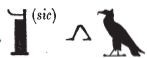
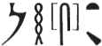
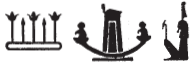
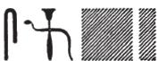

## Esna 156 {-}  
  
  
  
  
- Location: Column A
- Date: Domitian 
- [Hieroglyphic Text](https://www.ifao.egnet.net/uploads/publications/enligne/Temples-Esna002.pdf#page=341){target="_blank"}  
- Bibliography: @sauneron-1, pp. 62-63 (excerpts); see also [Tempeltexte 2.0](http://www.tempeltexte.uni-tuebingen.de/portal/#/text-detail/796){target="_blank"}    

^11^ *ỉȝw n=k   *  
*ỉn nṯr.w tȝ   *  
*ḥnmm.t ḥm.t-rȝ  *  
*m ksw* ^12^ *n bȝw=k  *  
*nṯr.w m ḫ(ȝ)ḫ  *  
*r wṯz-nfrw=k  *  
*nṯr.yt m sns* ^13^ *n ḥr=k  *  
*tȝ.wy ḫȝs.wt (ḥr) snỉ-tȝ  *  
*n šfy.t=k  *  
    
*ȝḫy.t* ^14^ *wbg.tw m np(r)y  *  
*m ḥr=k nfr  *  
^15^ *ḫsbḏ šd(.t)*   
*ww  ṯḥn.tw*  
*mn.w* ^16^ *ẖr šmȝ.w  *  
*šȝ.w nb wȝḏwȝḏ(.w) r ḫft-ḥr=k  *  
*prḫ=sn m ḥr=k nfr  *  
  
*ṯḥn kȝ=k  *  
*wnf ḥr=k  *  
*ȝw-ỉb=k  *  
*m s.t wnn=k  *  
  
^11^ Praise be to you,  
by the gods of earth.  
The sunfolk, etc.  
are bent down ^12^ before your power.  
The gods hurry  
to carry your perfection;  
goddesses praise ^13^ to your face.  
All lands kiss the earth  
for your prestige.  
  
The *ȝḫ*-field blossoms with grain  
for your beautiful face,  
^15^ the flooded land is lapis lazuli,  
the agricultural district scintillates,  
the basins ^16^ carry petals,  
all plants are verdant before you,  
they open up in your beautiful face.  
  
Your Ka sparkles,  
your face rejoices,  
your heart delights  
in the place you are.
   

   
  

   
    
*ʿḏʿḏ n=k ỉḥ.wt  *  
*ḥr mẖr.t=sn  *  
*ḫntš n=k ȝpd.w  *  
*ḫnt sš=sn  *  
*nhm n=k ḏw.w  *  
*thm n=k ʿ.wt=sn  *  
^17^ *ȝb n=k htt.w  *  
*ỉmy.w Kns.t  *  
*ḥyt.yw n=k m htt  *  
  
*hn n=k ḏȝḏȝ.t ʿȝ.t   *  
*tp.t-Nwn  *  
*sḥtp tw=k Nwn wr   *  
*ḥnʿ ỉmy.w-ḫt=f  *  
*ʿ.wy=sn ʿn(.w) m ḥnf  *  
     
*ḥm-nṯr=k pr=k ỉm=s  *  
*ḥr dwȝ=k rʿ-nb  *   
  
The cows ululate for you  
in their stable,[^fn-156-1]  
the birds jubilate for you  
within their nests.  
The mountains rejoice for you,  
their wild goats bleat(?)[^fn-156-2] for you.  
^17^ The baboons within Kenset  
dance for you;  
the apes chatter for you.  
  
The Great Council over Nun  
perform the *hn*-dance for you.  
Great Nun appeases you  
along with his followers:  
their arms are turned back in praise.[^fn-156-3]  
  
Your priest, from whom you emerge(?),  
worships you every day.  

[^fn-156-1]: {width=10%} - This seems to be an orthographic variant of *mẖr.t*, "granary; storehouse", which also houses cows in [Esna 155], 4.
[^fn-156-2]: {width=10%} - This term does not seem to be related to *thm*, "to round up; incite" (*Wb* V, 321, 6-14).
[^fn-156-3]: {width=15%} - Notable spelling.

    
*rwḏ nb ẖr s.t-ḥr=k  *  
*ntk ṯȝw n ʿnḫ  *  
*n nṯr.w rmṯ  *  
*snsn fnḏ nb  *  
*ʿnḫ=sn ỉm=k  *  
      
^18^ *nb kȝ.w  *  
*ʿšȝ ḏfȝw  *  
*nb np(r)y  *  
*ʿšȝ Rnn.t  *  
     
*mḥn.t=f m-ḫt=f  *  
*r grg tȝ m wḏ=f  *  
*(ḥr) spẖr tȝ-mrỉ  *  
*m rn=f  *  
*r ḫw(.t) tȝ.wy  *  
*m wr-šfy.t  *  
*wbn m Nwn  *  
   
All plants are under your control.  
You are the breath of life  
for gods and people,  
all noses breath,  
and they live through you.  
  
^18^ Lord of food,  
numerous of provisions,  
lord of grain,  
plentiful of Renenutets.  
  
His uraeus is with him,  
to found the earth through his decree,  
encircling the Beloved Land (Egypt)  
in his name,  
in order to protect the two lands,  
as the one Great of Prestige,  
who arose from Nun.

*nfr.wy ḥr=k  *  
*dm šw.ty=k r p.t  *  
     
*dwȝ tw nṯr.w ȝḫty.w  *  
*ỉw n=k ỉmy.w p.t m ḥʿʿ  *  
*n snḏ n šfy.t=k  *  
  
*dwȝ n=k ỉn nṯr.w dwȝ.t  *  
^19^ *ỉmnty.w m ỉȝw n ḥr=k  *  
*nṯr.w pȝwty.w  *  
*ʿ.wy=sn m dwȝ kȝ=k  *  
  
*sḥtp tw=k bȝ.w ỉmnty.w  *  
*sḏr n=k sʿḥ.w *  
*ḥr ẖ.t=sn  *  
*ʿḥʿ n=k sḏr.w*   
*ḥr tmȝ.t=sn  *  
     
How beautiful is your face!  
Your double plumes pierce the sky.[^fn-156-4]    
  
The gods of the Akhet praise you,  
those in heaven come to you in joy  
out of fear for your prestige.  
  
You are praised by the gods of the Duat,  
^19^ the Westerners worship to your face,  
the primeval gods,  
their arms are worshipping your Ka.[^fn-156-5]    
  
The western Bas appease you:  
the mummies lie down for you  
upon their bellies;  
the recumbent ones stand up for you  
upon their mats.[^fn-156-6]
  

[^fn-156-4]: {width=15%} - For this epithet, see primarily @budde-himmel.
[^fn-156-5]: {width=12%} - As @sauneron-2, p. 271, n. a, noted, the word "Ka" is here spelled with the number 4, just as in [Esna 191], 19. The spelling derives from the proverbial Four Kas of Ptah: @sauneron-rde15, pp. 60-61; @meeks-ka.
[^fn-156-6]: For the residents of the Duat reversing positions upon the arrival of the solar god, see also [Esna 163], 26.

*sḥḏ.n=k dwȝ.t   *  
*n dwȝty.w  *  
*ʿq=k r=sn m ṯȝw [...]  *  
*[...] nwn ẖr=sn  *  
      
*ntk ỉt bnr   *  
*n ỉmy.w ḥw.t-bȝw  *  
*Nb.t-ww(?) pw m* ^20^ *mȝʿ.t  *  
*štȝ.t zp-snw  *  
*ỉmn zp-snw  *  
*nỉ rḫ=s ỉn rmṯ nb.w  *  
*nỉ ḫnd=s ʿ.wt  *  
*nỉ ʿr=s s.t  *  
*wḏȝ tȝ r-ḏr=f  *  
*r ḫrwy.t  *  
  
You illumined the Duat  
for the Datians,  
you enter towards them as air [...]  
[...] Nun beneath them.  
  
You are the sweet father  
to those within Temple of the Bas,[^fn-156-7]  
that means Nebtu(?)[^fn-156-8] is Maat.  
Very mysterious,  
very hidden:  
it cannot be known by any people,  
livestock may not tread upon it,  
a woman may not approach it,  
so that the entire land might be safe[^fn-156-9]  
from a calamity.[^fn-156-10]
      

[^fn-156-7]: When Khnum-Shu enters the Temple of the Bas in North Esna, he usually brings the breath of life to the deceased ancestors: e.g. *Esna* III, 196, 11.
[^fn-156-8]: {width=15%} - Reading uncertain, but since the context refers to Khnum-Shu entering the necropolis of North Esna to give breath to the deceased, presumably this goddess should be Nebtu. The knife elsewhere writes both *n* and *m* (@sauneron-8, pp. 192-193), and this value might derive from *nm*, "knife" (*Wb* II, 263, 10).
[^fn-156-9]: {width=15%} - The *wṯz* sign is a mistake for *wḏȝ* (cf. @sauneron-2, p. xxxv), as confirmed from other examples of this phrase: [Esna 127], 10; *Esna* III, 196, 8; 197, 21.
[^fn-156-10]: Compare similar descriptions of the secret, divine mound at North Esna: [Esna 81], 2; [Esna 127], 9-10.

*ḥȝp.tw ẖȝ.t=k  *  
*ḏsr.tw s.t=k  *  
*hyn n ḥm=k  *  
*snḏm=k m-ḫnt=f  *  
*nỉ ḥr=k r tȝ-sn.t  *  
*mry ỉb=k  *  
*s.t zbỉ-sš.w *   
*n kȝ=k  *  
    
*gm=k ḫnty* ^21^ *ʿȝ wr  *  
*ʿpr(.w) m wḫȝ  *  
*dwn(.w) m-ḥzỉ ḥm=k  *  
*mỉ ṯwf swtwt=k r mȝȝ=f  *  
*ỉn.n=k Bȝq.t m [...] zp snw  *  
*m grḥ wʿ  *  
   
*mỉt.t=f   *  
*r mỉt.t nty ỉm=f  *  
*r nty m-ḫnt=f  *  
   
*ẖnm.t=sn bʿḥ(.w)   *  
*ẖr rm.w ȝpd.w  *  
*mḥs nb ʿpr(.w)   *  
*m kȝ.w ỉḥ.wt  *  
*m sšp nb n nṯr  *  
  
Your corpse is hidden,  
your place is kept sacred.  
It is a dwelling[^fn-156-12a] for your Majesty,  
in which you reside.  
You do not stray for Esna,  
which your heart loves,  
the place of 'roaming the marshes'   
for your Ka.  
  
You find the ^21^ very great pronaos,  
equipped with papyriform columns,  
extending to meet your Majesty,  
like a papyrus thicket you travel to behold.[^fn-156-12b]  
You reached Egypt in [...] a second time,  
in a single night.[^fn-156-12c]  
  
Its likeness  
is like the replica in it,  
like that which is within it.[^fn-156-12]  
  
Their basins are overflowing  
with fish and fowl;  
all pastures(?)[^fn-156-13] are equipped  
with bulls and cows,  
in all forms of a god.[^fn-156-14]

[^fn-156-12a]: For Esna as the *pr-hyn* for Khnum, see *Esna* III, 377, 8; *Esna* IV, 431, 3: @klotz-baboons, p. 44, n. a.
[^fn-156-12b]: Similar phrases to describe the pronaos in [Esna 155], 1; [Esna 190], 1.
[^fn-156-12c]: Yet another allusion to Khnum journeying between Esna and Chemmis overnight.
[^fn-156-12]: Same gnomic set of statements in [Esna 176], 4-5; [Esna 190], 2; [Esna 191], 21; similarly [Esna 155], 3. From these texts, it seems to refer to Esna being a copy of Chemmis, perhaps containing a microcosm of Chemmis within it.
[^fn-156-13]: {width=15%} - The same term occurs in a similar context in [Esna 191], 21. The present translation follows the suggestion by @sauneron-1, p. 63, n. a, which fits the general context.
[^fn-156-14]: Here begins another list of sacred bulls and cows, each linked to specific divinities. See also [Esna 190], 3-10; [Esna 191], 22-27. As in the other lists, most of the bovine names are uniquely attested here, and it is often difficult to propose a transliteration, or even determine whether it is a cow or bull. Toward the end of this text, we also see the titles or nicknames for various herdsmen linked to specific types of cattle.

^22^ *šb.wy n sḥḏ-wr  *  
*zȝ.w n ỉtn-m-hrw=f  *  
*hb.w n Bȝbȝ  *  
*bhȝ.w n Ptḥ  *  
*ḥby.w n šw tfn.t  *  
*nty.w n N.t  *  
*šms.wy [n ...]  *  
*[...] n wtṯ  *  
*btȝy.w n ḫnty tȝ-nn.t  *  
*szp.w n sḫt-šzp=f  *  
*sȝḥ.w n Nḥb-kȝ.w  *  
*wr.w* ^23^ *n Ptḥ-Irỉ-tȝ  *  
*šsṯy.t n ḥqȝs  *  
*nfr.t-ỉmȝ n Mr.t nb.t ḥz.w  *  
*ptḫy.w n ḥr ȝḫ-bỉ.t  *  
*ḫbsy.t n nṯr[.w...]  *  
*[...]   *  
   
^22^ The *šbwy*-bull for Sehedj-wer,  
*zȝ*-bulls for the Aten in his day,  
*hb*-bulls for Bebon,  
*bhȝ*-bulls for Ptah,  
the *ḥby*-bull for Shu and Tefnut,  
*nty.t*-cows for Neith,  
*šms*-cows [for ...]  
[...] for the Procreator,  
*btȝy*-bulls for Foremost of Tjenenet,  
*šzp*-bulls for He who Weaves his Light,  
*sȝḥ*-bulls for Nehebkau,  
*wr*-bulls ^23^ for Ptah-Irita,  
the *sšṯy.t*-cow for Heqas,  
the Good Charmer for Meret, Lady of Songs,  
*ptḫy*-bulls for Horus of Chemmis,  
the *ḫbsy.t*-cow for the god[s...]  
[...]

*dsy.t n dwȝ-mw.t=f  *  
*ḫw.w n Imn-Rʿ  *  
*rʿy n Itm(?)  *  
*ỉd.wt n* ^24^ *ḫf-br.wy  *  
*spy n šw  *  
*ʿḫy.t n tfn.t  *  
*zpy n *   
*pr-m-snw.t  *  
*bẖ.w n ṯnn.t  *  
*štȝ-ḥn.ty *  
*n Rʿ ḥtp=f  *  
*ỉbty.w n [...]  *  
*[...] ʿšȝ *  
*n Itm nb Iwnw  *  
*nfr.w n ḥr šd.t  *  
*šzp *  
*n tkȝ n ḥpḥp  *  
*ndm-ḫrw* ^25^ *n Rnn.t  *  
*ḫbn-ḫrw n šw  *  
*mỉ.w n bȝ.w fdw  *  
*bʿḥ.w n Ptḥ nfr-ḥr  *  
*sȝḥ.w n Igr.t  *  
*kȝ.w n r'-ȝw  *  
*[...]   *  
*[...n]sw.w n rmn-mw.t=f  *  
*(??) n sbk šd.t  *  
     
The *dsy.t*-cow for Duamutef,  
the *ḫw*-bulls for Amun-Re,  
the ray-bull for Atum(?) [...]  
cows for ^24^ The Two Eyes See,  
the *spy*-bull for Shu,  
the *ʿḫy.t*-cow for Tefnut,  
the *zpy*-bull for   
He Who comes from Senut,[^fn-156-15]  
the Buchis bulls for Tjenenet,[^fn-156-16]  
the secret-horned bull   
for Re as he sets,  
the *ỉbty*-bulls for [...]  
[...] numerous  
for Atum, Lord of Heiopolis,  
*nfr*-bulls for Horus of Shet(?),  
the bright-bull   
for the Torch of Hephep,  
the sweet-voice cow ^25^ for Renenutet,  
the guilty-voice bulls for Shu,[^fn-156-17]   
*mỉw*-bulls for the Four Bas,  
*bʿḥ*-bulls for Ptah-Neferher,  
*sȝḥ*-bulls for Igeret,  
bulls for Tura,  
[...]  
[...]*ns*-bulls for Remenmutef,  
the (??)-bull[^fn-156-18] for Sobek of Shedet.  

[^fn-156-15]: The same god is mentioned in [Esna 190], 5, but with a different sacred animal.
[^fn-156-16]: Amidst this seemingly random list of sacred bulls and cows, the Buchis bull was revered north of Esna in Armant, where Tjenenet was the chief goddess. Remarkably, Bucheum Stela 9 records an event where a special bull was recognized as a possible Buchis in Asfun, and brought specifically to Esna for inspection. Did this city, home of Khnum Lord of the Field and Chief of the Herdsmen, have a monopoly on sacred cattle?
[^fn-156-17]: {width=18%} - Noteworthy spelling of "Shu", with the elaborate bark write *w* < *wỉȝ*.
[^fn-156-18]: {width=15%} - Uncertain how to transliterate this name. Possibly *bnr.ty* or *mȝmȝ*, based on two words for palm trees.

*kȝ.w ỉḥ.w mn(.w) m bȝḥ=k  *  
^26^ *ḥnʿ wr.w nw mnỉ.w  *  
*m.k (pr-ʿȝ)| r-gs=w  *  
*ỉp.n=f ṯnw nt ỉḥ.w=k  *  
*zȝ.tw m thỉ bȝk=sn  *  

*ỉn=f n=k wr.w nw sȝ.t  *  
*wr.w nw mnỉ.w  *  
*ỉmy-rȝ.w ḫȝ-tpy.w  *  
*dmḏ(.w) [...]   *  
*[...] mnỉ n kmy.w  *  
*bȝḥ-m-msn mnỉ n šbn.w  *  
*ḫȝw.t* ^27^ *mnỉ n wȝḏy  *  
   
*ỉn=f n=k sšmw wsr   *  
*mnỉ n sZp.w  *  
*ỉn=f n=k ỉdr  *  
*mnỉ n ḥbʿy  *  
*ỉn=f n=k zȝ-nḏm-ỉb  *  
*mnỉ n ḥḏ-wry  *  
*[...]   *  
*mwnf n dšr.w  *  
   
The bulls and cows endure before you,  
^26^ with the chiefs of the herdsmen.  
Behold, (Pharaoh)| is beside them,  
he has tallied the number of your cows.  
Beware of interrupting their work!  
  
He brings you the chiefs of the stable,  
the chiefs of the herdsmen,  
the overseers, the first-thousand,[^fn-156-19]    
united [...]  
[...] the herdsman of the black bulls,  
*bȝḥ-m-msn*, herdsman of the mixed bulls,  
*ḫȝw.t*, ^27^ herdsman of the green bull.  
  
He brings you Mighty Shesemu,  
herdsman of the bright bulls;  
he brings you He of the Herd,  
herdsman of the *ḥbʿy*-bull;  
he brings you Sweetheart Son,  
herdsman of the great white bull   
[...]  
protector of the red bulls.  

[^fn-156-19]: This is apparenly a military or aulic title referring to generals or other high-ranking Egyptians: cf. *PWL*, p. 699. In the present text it seems to designate elite herdsmen.

*swȝḏ-[bȝ?] m ḥr-ỉb ỉry  *  
*^28^ r-gs nsw.t-bỉty  *  
*nb-tȝ.wy  *  
*(ȝwṯgrtwr kysrs)|  *  
*zȝ-Rʿ nb-ḫʿ.w  *  
*(ṯwmtyns nty-ḫwỉ)|  *  
    
*smn=f mdw=k m sš.w   *  
*m rnp.wt r-ḥn.ty  *  
    
*dỉ[...]  *  
*[...] ʿḥʿ=f  *  
*smn=k rnp.wt=f   *  
*mtn=k s(w) r-ḥn.ty  *  
  
*swȝḏ-[bȝ?]*[^fn-156-20] is in their midst,  
^28^ beside the King of Upper and Lower Egypt,  
Lord of the Two Lands  
(Autokrator Caesar)|  
Son of Re, Lord of Appearances  
(Domitian Augustus)|  
  
He establishes your words in writing,  
for years in the future.  
  
May [you] give [...]  
[...] his lifetime.  
May you establish his years.  
May you reward him in perpetuity.

[^fn-156-20]: {width=18%} - The restoration makes sense in the context, since this is a popular epithet for Khnum-Shu: *LGG* VI, 210b-c.