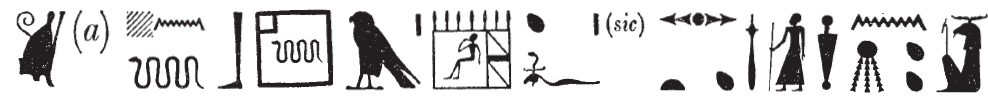
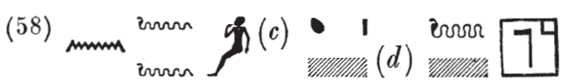
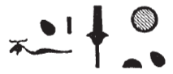
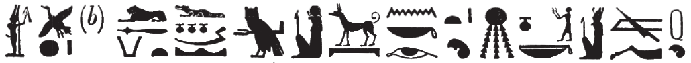

## Esna 157 {-}

- Location: Column E, Lower Bandeau
- Date: Domitian
- [Hieroglyphic Text](https://www.ifao.egnet.net/uploads/publications/enligne/Temples-Esna002.pdf#page=376){target="_blank"}
- Bibliography: @recklinghausen-2014, p. 137, n. f (157 B, partial)

#### Esna 157 A {-}

| *ʿnḫ nṯr nfr  *
| *dỉ-ʿ m sqd   *
|   *r ḥw.t-Mw.t  *
|     *r ỉr(.t) ȝḫ.w n mw.t=f  *
|
| *nb nfrw  *
| *(twmtyns ḫwỉ)|  *
|
| Live the good god,
| who sets out on a journey 
|   to the Temple of the Mother
|     to perform benefactions for his mother.
|
| The lord of goodness,
| (Domitian Augustus)|

#### Esna 157 B {-}

NB: Without the aid of parallels, this short text would be one of the most difficult to decipher. The repeated child signs make it clear this is about Heka the Child, and like with [Esna 164 B], the epithets and unusual spellings occur in the great, acrophonic litany to Heka on interior columns 6 and 12 (*Esna* III, 242 and 323)

{width=70%}

| *nsw.t-bỉty *
| *zȝ-tȝ nb ḥw.t-nṯr  *
| *ḥkȝ wr-ḥkȝw *
|    *zȝ Sḫm.t  *
| *ʿȝ wr tpy n ẖnmw  *
|
| King of Upper and Lower Egypt,
|  zȝ-tȝ-serpent, Lord of the Temple [^fn-157-1],
| Heka[^fn-157-2], greatest of magic [^fn-157-3],
|   son of Sakhmet [^fn-157-4],
| the very great, first-born of Khnum [^fn-157-5].

[^fn-157-1]: This epithet, partially damaged, is paralleled in the Heka litany (*Esna* III, 242, 23, 58): {width=45%}. In the present version, the first snake writes *zȝ-tȝ*, and *nb* is written phonetically; the first two signs are perturbed, just as with *zȝ* and *wr-ḥkȝw* later.  
The spelling of temple with the same serpent occurs elsewhere at [Esna 56] and *Esna* III, 243, 9.  Confusingly, that same sign (palace with serpent) alone writes "Heka" in his litany (*Esna* III, 242, 19 (26)).  
As a child god, Heka is identified as an agathos-daimon serpent who brings the harvest and makes plants thrive. This is also due to his frequent association with Geb, god of the earth and master of serpents.

[^fn-157-2]: A similar spelling of Heka (Horus + child in palace) occurs in his litany, *Esna* III, 242, 24 (73). Multiple version of his name feature a child within a similar building (@sauneron-8, pp. 95, 165-166), likely derived via acrophony *k* < *qnḥ*, "palace." In this text, both composite palace signs show versions of Heka (serpent and child) within his temple.

[^fn-157-3]: Common epithet of Heka at Esna. The '(sic)' in Sauneron's copy indicates that the first two signs are inverted.  First read the serpent (< *wr-ḥkȝw*, "the wer-hekau wand" from the Opening of the Mouth Ritual), then *zȝ*. The same occurs in Heka's litany (*Esna* III, 242, 16 (5)): {width=20%} 

[^fn-157-4]: Unique spelling of Sakhmet, providing evidence this sign was pronounced *sḫm* rather than just *ḫm* (@kurth-1, p. 365, No. 33). *LGG* VI, 95a, recorded this epithet, but seemed to suggest the *wr-ḥkȝw* serpent wrote the uniliteral *s* in Sakhmet.

[^fn-157-5]: This spelling of Khnum sometimes appears with signs inverted (pupils *then* radiant sun), in which case it writes the name of his consort, Menhyt.

{width=25%} 
{width=70%}

| *ỉwr m sf  *
| *ms m* [^fn-157-7] *pȝ hrw  *
| *rw ʿȝ štȝ ḫnt Mȝnw  *
|   
| *mỉ Rʿ  *
| *ỉp.tw n=k ỉr.t=f  *
| *ỉhy n=k  *
|   *ḥr ṯmȝ-ʿ rn=k  *
|
| He who was conceived yesterday, [^fn-157-6]
| and born today,
| the great, mysterious lion in Manu.
| 
| Come, Re!
| Your eye has been filled [^fn-157-8] for you,
| hail unto you:
|   Horus, valiant of arm is your name.

[^fn-157-6]: As noted recently (@recklinghausen-2014, p. 137, n. f; already *LGG* IV 651b), this entire section excerpts a well-attested litany to the god Re (@gasse-1984, pp. 206-207; Recklinghausen added an extra parallel in *KO* 898). Notably, it is from the section invoking Re as "Lord" or "Great of Magic", just like Heka here. 
More direct parallels for this text occur in the litany to Heka, and a later offering scene (*Esna* III, 242, 28 (104-106); VII, 609, 13), as noted by @recklinghausen-2014, p. 137, n. f.
In the present example, the verb *ỉwr* derives from *ỉ(ȝ.t)*, "mound" + *ww*, "field" + *r(r.t)*, "hippo", evoking the prototypical divine birth in the marshes of Chemmis, surrounded by protective hippo goddesses.  In the word *sf*, "yesterday", the first uniliteral *s* is acrophonic from *spẖr*, "to inscribe", or possibly just using the consonantal principle from *zš*, "to write".

[^fn-157-7]: *m* < "Min", as in [Esna 185 A].

[^fn-157-8]: *ỉp* < *ỉw(ỉw)*, "dog" + *p(.t)*, "sky".