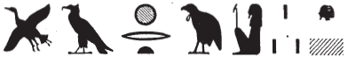

# Column B (159-165) {-}  
  
## Esna 159 {-}  
  
  
  
- Location: Column B, upper bandeau  
- Date: Domitian  
- [Hieroglyphic Text](https://www.ifao.egnet.net/uploads/publications/enligne/Temples-Esna002.pdf#page=347){target="_blank"}  
- Bibliography: None  
  
#### Esna 159 A {-}  
  

  
  
*šw ṯmȝ-ʿ   *  
*ḥwỉ ẖȝk.w=ỉb  *  
*šzp mʿȝby.t   *  
  *r sḫr ḫfty=f  *  
*sšm ỉr Hzw.t=f  *  
  *ḥr wȝ.t-nḥḥ  *  
*ẖnmw ḫnty pr-nṯr  *  
   
Shu, valiant of arm,  
who smites the disaffected,  
who seizes the harpoon  
  to fell his enemy,  
who guides whomever does what he praises[^fn-159-1]  
  upon the path of eternity:  
Khnum, foremost of Per-netjer  
  

  
  
[^fn-159-1]: {width=20%}{width=18%}. Reading uncertain. This might also be an epithet about loyalty to the god, such as *ỉr.w (ḥr) wȝ.t=f*, "those who are upon his path." (@vittmann-weg, p. 168, s.v. *jr ḥr wȝt*).  
  
#### Esna 159 B {-}  
  

  
  
*tȝ-ṯnn mrw.ty  *  
*pȝwty.w-tp[y.w] r-ḫt ḥm=f  *  
*ẖnmw-Rʿ nb tȝ-sn.t  *  
*nṯr-ʿȝ ḫnt Iwny.t  *  
   
Tatenen, the beloved,  
the first primeval ones [^fn-159-2]  
  follow his majesty:  
Khnum-Re, lord of Esna,  
great god, foremost of Iunyt.  
  

  
  
[^fn-159-2]: {width=30%}