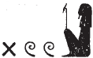
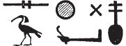
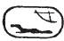

## Esna 162 {-}  
  
- Location: Column B, middle  
- Date: Domitian  
- [Hieroglyphic Text](https://www.ifao.egnet.net/uploads/publications/enligne/Temples-Esna002.pdf#page=350){target="_blank"}  
- Bibliography: @sauneron-1, pp. 65-66 (partial); @leitz-2014, pp. 1036-1037.  
    
  
  

^1^ *ḥr ṯmȝ-ʿ  *  
*wr-pḥty  *  
*ḥwỉ ḫȝs.wt  *  
*nḫt bȝq.t  *  
*nsw.t-bỉty  *  
*nb-tȝ.wy  *  
*(ȝwtwkrtwr kysrs)|  *  
*zȝ-Rʿ nb-ḫʿ.w  *  
*(tmtyns nty-ḫwỉ)|  *  
*[ʿnḫ mỉ Rʿ] ḏ.t  *  
*[...]  *  
  
^1^ Horus, valiant of arm,  
great of strength,  
who strikes the foreign lands,  
protector of Egypt,  
King of Upper and Lower Egypt,  
Lord of the Two Lands  
(Autokrator Caesar)|  
Son of Re, Lord of Appearances  
(Domitian Augustus)|  
[living like Re] eternally  
[...]

*[...] ḥw.t-ẖnmw  *  
*ỉt-ỉt.w mw.t-mw.wt  *  
*mw.t-nṯr   *  
*qmȝ ḫmny.w  *  
*ỉr Rʿ ỉwty snw=f  *  
*pȝwty.w tpy(.w)  *  
*r-ḫ.t ḥm=s  *  
*šȝʿ ỉḫt nb tp-ʿ  *  
    
^2^ *qmȝ.n=f Iwny.t  *  
*m kȝ.t nt ỉz  *  
*m pr ỉr.n tpy.w-ʿ  *  
    
*sbȝ(.w)=sn ḫtỉ(.w)   *  
*m rk nsw.wt ḏrty.w  *  
*ỉnb=sn m hȝw p[ȝwty.w]  *  
*[...]  *  
*ẖr-ḥȝ.t  *  
  
[...] the temple of Khnum.  
Father of fathers, Mother of Mothers,  
Mother of God,  
who created the Ogdoad,  
who made Re, without his double,  
the First Primeval Ones  
follow her Majesty,  
she who created everything long ago.[^fn-162-1]  
  
^2^ He created Iunyt  
as a classical style work,  
in the domain made by the ancestors.  
  
Its portals (were) inscribed  
in the time of the ancestor kings,  
its walls in the era of the pr[imeval...]  
[...]  
long before.

[^fn-162-1]: These epithets all denote Neith.

*sʿḥʿ.n=f ḥw.t-nṯr=s  *  
*wȝḥ(.w) ḥr snṯ=f  *  
*sḥ=s r bw wnn=f  *  
*wḫȝ.w m-rwty=s  *  
*r ḏsr* ^3^ *wbȝ=s  *  
*sbty.w pẖr(.w) ḥȝ=sn  *  
    
*qn.w m kȝ.t  *  
*ʿpr(.w) m smn(.w)  *  
*sʿrq(.w) m ỉrw=s nb.w  *  
     
*nbỉ.n=f gȝw.t ḥḏ  *  
*ỉmỉ[..] nbw  *  
*m wṯz-[nfrw?...]  *  
*[...]  *  
*[ỉḫt] nb   *  
*nw ỉr.t ỉḫt-nṯr  *  
  
He erected her temple,  
enduring upon its foundation,  
her chapel in the location it had been;[^fn-162-2]  
a hypostyle hall in front of it,  
in order to sancitfy its fourecourt,  
and enclosure walls encircling it all.  
  
It is complete in its work,  
equipped with statues,  
and finished in all its requirements.  
  
He fashioned a vessel of silver  
within [...] gold,  
as a processional [bark?...]  
[...]  
all [necessary things]  
for performing sacred rituals.

[^fn-162-2]: Apparently the naos of Neith was in its original, Pharaonic location, but the surviving pronaos was an extension.

   
*sḥḏ.n=f ḥw.t-[nṯr]=s  *  
*mỉ p.t  *  
*ḏsr.n=f ʿḥ=s  *  
*mỉ ȝḫ.t  *  
*sỉp.n=f* ^4^ *ỉȝ.t=s  *  
*nḏ.n=f r-pr.w=s  *  
*ỉnb.n=f ḥw.wt=s *  
*m mȝw  *  
*sḥn.n=f ḥnb.t=s  *  
*swsḫ.n=f tȝšw=s  *  
*swr.n=f ḥȝw ḥr *  
*mn.t [...]  *  
*[...]  *

*[...] ʿȝ.t nb.w n mȝʿ.t  *  
*sḫnt[.n=f] nỉw.t=s  *  
*swr.n=f ỉȝ.t=s  *  
*ḏbȝ.n=f sḫm=s   *  
*ḫnt ʿḥ=s  *  
  
He illumined her temple  
like sky,  
he sanctified her palace,  
like the Akhet,  
he inspected her ^4^ (sacred) mound,  
he protected her temples,  
he build walls around her shrines  
anew,  
he organized her temple estate,  
he broadened her boundaries,  
he magnified beyond what was  
(previously) for daily offerings [...]  
[...]  
  
[...] all precious stones,  
[he] advanc[ed] her city,  
he made great[^fn-162-3] her (sacred) mound,  
he replaced her sacred image  
within her palace.  

[^fn-162-3]: {width=12%} - Note the use of Nefertem to write *n=f* (< *nfr*) for the verbal form, as happens later with the regular *nfr* sign in col. 5; cf. @sauneron-1, p. 48, n. 1.

^5^ *sʿḥʿ.n=f ỉwn  *  
*n ỉwn-wr  *  
    
*wpy.n=f wḫȝ  *  
*n wr-ww  *  
  
*ḫws.n=f šnʿ  *  
*n šw  *  
   
*sȝḫ.n=f sšn  *  
*n zmȝ-mȝʿ.t  *  
     
*sḫy.n=f wȝḏ  *  
*n swȝḏ-bȝ  *  
     
*bs.n=f bȝw.t  *  
*n bȝ-wr  *  
    
*sʿȝ[.n=f ʿr(?)]  *  
*n (ỉw)ʿʿ n Rʿ  *  
     
*sȝḫ.n=f ȝḫ  *  
*n ẖnmw  *  
      
*wḏ.n=f wȝḏ  *  
*n wȝḏ-ḥr  *  
      
*ỉtḥ.n=f ỉdḥ  *  
*n* ^6^ *ỉdḥw  *  
      
*ḏsr.n=f šzp   *  
*n ḥḥ-n-ḥḥ.w  *  
    
*mȝwy.n=f* ^7^ *mnḥ*[^fn-162-5f]     
*n mȝỉ-ḥzȝ  *  
  
*snṯ.n=f* ^8^ *nḥm  *  
*n nḥb-kȝ.w  *
  
^5^ He erected a pillar  
for the Great Air-Pillar.[^fn-162-5]  
  
He opened a papyrus column  
for Great of the Field(?).[^fn-162-5a]  
  
He constructed a *šnʿ*-column  
for Shu.[^fn-162-5b]  

He made excellent an lotus column  
for the Companion of Maat.[^fn-162-5bb]   
  
He lifted up a papyrus column  
for *swȝḏ-bȝ*.[^fn-162-5c]  
  
He made rise up a bush  
for the Great Ba.  
  
He made great [a plant column][^fn-162-5d]   
for the heir of Re (= Shu).  
  
He made excellent[^fn-162-5dd] an *ȝḫ*-column  
for Khnum.[^fn-162-5e]   
  
He commanded a green column (*wȝḏ*),  
for Green of Face.  
  
He hauled up a papyrus column (*ỉdḥ*),  
for He of the Delta.  
  
He sanctified a bright column  
for Heh of the Heh-gods.  
  
He renewed a ^7^ papyrus reed  
for the Wild-faced Lion.  
  
He founded a lotus column  
for Nehebkau.

[^fn-162-5]: Here begins a long list of fanciful designations for the papyriform columns in the pronaos, most equated with different terms for papyrus or lotus plants; a similar section occurs in [Esna 183], 4-5. As in similar texts from these columns, there is heaven alliteration between the construction verb, the name for the column, and the god -- this alliteration will not be pointed out below, but it should usually be apparent in the corresponding transliteration.  The gods are usually forms of Shu, the god who supports the sky just like the columns; occasionally they are forms of Khnum, Esna's local version of Shu.
@leitz-2014, p. 1036 noted that between this text and [Esna 183], there appear to be 23 distinct columns called out here, only one less than the total 24 columns of the pronaos.
[^fn-162-5a]: {width=9%} - Reading uncertain, but likely based on the alliteration.
[^fn-162-5b]: For this term, see also [Esna 169], 3.
[^fn-162-5bb]: This is also an epithet of Shu: *LGG* VI, 310b-c.
[^fn-162-5c]: This is a popular epithet of Shu: *LGG* VI, 210b-c; also [Esna 176], 1.
[^fn-162-5d]: Restored based on alliteration, with the same term *ʿr* in [Esna 183], 5.
[^fn-162-5dd]: {width=12%} - Note the use of *nfr* to write *n=f* (< *nfr*) for the verbal form; cf. @sauneron-1, p. 48, n. 1.
[^fn-162-5e]: {width=10%} - For this spelling, see also [Esna 127], 5.
[^fn-162-5f]: For this term, see @sauneron-bifao64, p. 2; [Esna 176], 7.

*smn.n=f wbȝ  *  
*ẖr* ^9^ *wḫȝ.w  *  
*šzp.tw mỉ p.t  *  
*sḥḏ.tw mỉ tȝ  *  
    
*nỉ mnmn  *  
^10^ *nỉ nni  *  
*mỉ p.t ẖr Rʿ  *  
*mn.tw ḏd(.tw) rwḏ.tw  *  
*m tȝ pn ḏ.t  *

Thus he established the pronaos,  
bearing the columns:  
bright like heaven,  
illumined like the earth.  
  
Without shaking,  
without collapsing,  
remaining, enduring, solid,  
in this earth, forever.  

