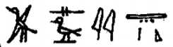

## Esna 163 {-}  
##### Hymn to Neith {-}

- Location: Column B, middle  
- Date: Domitian  
- [Hieroglyphic Text](https://www.ifao.egnet.net/uploads/publications/enligne/Temples-Esna002.pdf#page=351){target="_blank"}  
- Bibliography: @sauneron-5, pp. 287-295.
    
  
  

^11^ *ỉȝw n=ṯ  *  
*r qȝ n p.t  *  
*snỉ-tȝ   *  
*r sḫḫ n tȝ  *  
^12^ *hn n=t  *  
*r mȝȝ ḥp.ty  *  
*snỉ-tȝ n kȝ=t  *  
*r-ʿ wȝḏ-wr  *  
      
^13^ *nb.t tp-rnp.t  *  
*ḥqȝ.t ḫȝbs.w   *  
*ỉr.t Itm m ʿnḫ-tȝ.wy  *  
      
^14^ *nb.t ḫȝty.w  *  
*sȝwy šmȝy.w   *  
*[qdf]ty.w (ḥr)* ^15^ *ḥwỉ m wḏ=s  *  
*ʿnḫ mwt [ẖr] s.t-rȝ=s  *  
    
^16^ *ỉty.t n nṯr.w p.t  *  
*ḥqȝ.t n nṯr.w [tȝ]  *  
*nb.t-r-ḏr ỉs  *  
*n nṯr.w dwȝ.t  *

^11^ Praise be to you,  
to the height of heaven;  
kissing the earth,  
to the breadth of the earth;  
^12^ jubilation for you  
to the sight of the outer limits;  
kissing the earth for your Ka,  
as far as the Great Green sea.  
  
^13^ Lady of the New Year,  
Ruler of the Decan stars,  
she who made Atum[^fn-163-1] in Ankh-tawy.  
  
^14^ Lady of the knife-demons,[^fn-163-2]  
who owns the wandering demons,  
the [reap]ers[^fn-163-3] ^15^ strike at her command,  
life and death [are under] her authority.  
  
^16^ Sovereign of the gods of heaven,  
Ruler of the gods of [earth],  
the All-Lady meanwhile,  
of the gods of the Duat.

[^fn-163-1]: {width=20%} - This spelling of Atum also occurs in [Esna 54], 12; [Esna 67], 12; *Esna* III, 218, 9; cf. @sauneron-5, p. 293, n. b. 
[^fn-163-2]: Most of these epithets occur verbatim in *Esna* II, 14, 9-11; cf. @recklinghausen-derchain, p. 34.
[^fn-163-3]: For the restoration and this group of gods, see @sauneron-bifao64, pp. 5-7; *LGG* VII, 231b; *PWL*, p. 1072.

*ḥȝ.t nṯr.w  *  
*ḫpr ẖr-ḥȝ.t  *  
*šȝʿ ḫpr  *  
*nỉ ḫpr ḫpr.w  *  
*ḫpr ḫpr.w nb.w  *  
*m-ḫt ḫpr=s  *  
     
*ỉr(.t) nṯr.w nw pȝwty  *  
*qmȝ qȝy qȝ  *  
*sḫpr ỉtn  *  
*ḏ(d).tw n=f Rʿ  *  
*ḏr ỉni st.wt=f r-ʿ [tȝ]  *  
     
*ỉr nṯr.w m zbṯ=f  *  
*[m-ḫt mȝȝ]=f sy  *  
*ʿn=f s(w) r rmy  *  
^17^ *ḫft snỉ=s r=f  *  
*ḫpr rmṯ   *  
*m rmy.t n ỉr.t=f  *  
  
The beginning of the gods,  
who came about in the beginning,  
who *began* the beginning,  
before any creature had come about:  
all things came about  
after she came into existence.  
  
She who made the gods of the Primeval One,  
who created the high mound (of Hermopolis),  
who created the sundisk:  
he is also called 'Re' (*Rʿ*),  
as his rays reach the limits (*r-ʿ*) of the [earth].  
  
He who made the gods from his laugh,  
[after] he [saw] her (Neith).[^fn-163-4]  
He started again to cry (*rmy*)  
^17^ when she went away from him:  
thus humans (*rmṯ*) came about  
from the tears (*rmy.t*) of his eye.

[^fn-163-4]: Restored from a similar passage in the Neith cosmogony: *Esna* III, 206, 9, §13.

*dỉ(=s) sw ḥr tp=s  *  
*m ỉrw=s n ȝh.t  *  
*mḥỉ=s ẖr=f  *  
*m Mḥ.t-wr.t   *  
  
*[...]=s sbỉ   *  
*ḥr=f ḥr mw  *  
*ḥtm=s ʿȝpp m rk=f  *  
*snḏm=f ḥr wp.t=s  *  
*m-ẖnw mw  *  
*r spr=s r zȝw m wḫȝ   *  
*[...]  *  
  
She placed him upon her head  
in her form of a cow,  
she floated (*mḥỉ*) with him  
as Mehet-weret (*Mḥ.t-wr.t*).  
  
She [attacks] whomever rebels  
against him on the water,  
she destroys Apophis in his time;  
he sits upon her horns  
within the water,  
until she reaches Sais in the night  
[...][^fn-163-5] 

[^fn-163-5]: @sauneron-5, p. 289, restores the date of Neith's evening festival described on [Epiphi 13].

^18^ *mw.t-nṯr Rʿ  *  
*qmȝ Itm  *  
*Mḥ.t-wr.t   *  
*sḫpr ḏȝỉs.w  *  
*ȝh.t qmȝ ḫmnỉ.w  *  
*ḥr spr tȝ-sn.t   *  
*m [...]  *  
*s.t mr ỉb=s  *  
*n ʿ.t-rsy.t  *  
    
*ḫnmỉ.w m ỉȝw  *  
*n ḥr=s  *  
*ḏȝỉs.w wr.w   *  
*m zȝ n ḥʿw=s  *  
     
*sbk Mnḥwy   *  
*ḥr ỉr(.t) n=s ỉȝw  *  
*twtw ʿȝ šmʿ-nfr *  
*ḥr sȝ=s   *  
*[...]  *  
*^19^ ḥr-šdnw ḥr-gs=s ỉmnty  *  
  
^18^ Divine Mother of Re,  
who created Atum;  
Mehet-weret,  
who created the Djaisu;  
Cow who created the Ogdoad,[^fn-163-6]  
reaches Esna   
in [...]  
the place her heart prefers  
in the Southern District.  
  
The Ogdoad[^fn-163-7] are in praise  
before her;  
the great Djaisu  
protect her body.  
  
Sobek and Menehwy[^fn-163-8]  
make adoration for her;  
Great Tutu and Shemanefer[^fn-163-9]  
are behind her  
[...]  
^19^ Horus of Shedenu is on her western[^fn-163-9b] side.

[^fn-163-6]: Amunet at Thebes is often associated with Neith, particularly as an Ihet-cow associated with the Ogdoad and the birth of Re: @klotz-caesar, pp. 71-74.
[^fn-163-7]: {width=10%} - For this spelling of the Ogdoad with walking legs representing the nisbe ending, cf. @klotz-ram, p. 73, n. 33.
[^fn-163-8]: {width=10%} - @sauneron-5, pp. 289, 293, n. i, thought this was a group writing Menehwy, with the first crocodile god merely holding the god's knife. Instead, I suggest the first crocodile here is Sobek, juxtaposed with Neith's other saurian son Shemanefer in the next verse. Both gods show up in [Esna 185 A], where the crocodile with a crown writes *s* < 'Sobek'.
[^fn-163-9]: {width=15%} - @sauneron-5, p. 289, read the group as 'Tithoès le grand coutelier', whereas @kaper-tutu, p. 237, understood the second crocodile as a writing of *pḥty*, "strength." Based on the of gods in the preceding verse, I prefer to identify both Tutu and Shemanefer, both children of Neith revered at Esna.
[^fn-163-9b]: {width=5%} - As @sauneron-5, p. 294, n. x, noted, this ram-headed falcon sign represents the western wind (cf. @riggs-soter, pp. 329-329), as also represented on the ceiling: *Esna* IV, 451, Right (Ouest). This is similar to the southern and eastern winds featured in [Esna 105] and [Esna 128], and the hieroglyph showing the northern wind later on in [Esna 163], 26. 

*nṯr.w m hy  *  
*nṯr.yt m ṯhh  *  
*pʿy.t rḫy.t m wȝḥ-tp  *  
*p.t m ḥb  *  
*tȝ m ḥʿʿ  *  
*tȝ-sn.t ʿpr(.w) m ȝḫ.w=s  *  
*zȝw=s pw m tȝ-šmʿ  *  
      
*dr.n=s ȝh ḫpr ỉm  *  
*sḫr=s sbỉ.w   *  
*m ȝḫ tp-rȝ=s  *  
    
*spd.t ḥnw.t ḫȝbs.w  *  
*sšȝ.t wr.t nb.t sš.w  *  
*hȝy.[ty?]* ^20^ *ẖr snḏ=s  *  
*tȝ ẖr šfy.t=s  *  
*tȝ.w ḫȝs.wt   *  
*(ḥr) sdȝdȝ n ḥry.t=s  *  
      
*ḥry-ḫndw *  
*m ws-n-p.t  *  
*ḏsr-sštȝ*   
*m sbḫ.t štȝ.t  *  
  
Gods are in jubilation,  
goddesses are overjoyed,[^fn-163-10]  
both *pʿ.t* and rekhyt bow their heads.  
The sky is in festival,  
the eart rejoices,  
Esna is equipped with her excellent power,  
it is her Sais in Upper Egypt.  
  
She removed the suffering that happened there,  
striking down the rebels  
with the power of her utterances.  
  
Sothis, Mistress of the Decan stars.  
Seshat the Great, Lady of Writing.  
The [two] firmaments ^20^ are in fear of her,  
the earth bears respect for her,  
all lands, domestic and foreign,  
tremble out of terror for her.  
  
She upon the Staircase,  
in 'The Window of Heaven.'[^fn-163-11]   
Sacred of secret image  
in the Mysterious Portal.

[^fn-163-10]: {width=25%} - Evocative spelling of "gods and goddesses," appropriate to Neith, the crocodile mother of Sobek and Shemanefer.
[^fn-163-11]: The epithet and toponym ("window of heaven") identify Neith here as Bastet: @meeks-delta, pp. 249-251. @sauneron-5, p. 290, did not catch the reference, but later wrote a short essay about this location: @sauneron-bifao69, pp. 51-53, without mentioning this example.

*wn.tw  *  
*sšm=s r-gs zȝ=s Wsỉr  *  
*wn.tw zp-snw  *  
*ʿnḫ.tw zp-snw  *  
     
*Mnḥy.t ḥy m ḥʿpỉ  *  
*Nb.t-ww pw  *  
*sḫpr ỉḫt nb  *  
*ỉr.t sm.w  *  
*sḫpr wȝḥ.t  *  
*r sḫpr pr.t nb  *  
*n* ^21^ *qmȝ.n=s  *  
*ỉr.n=s ẖr.wt  *  
*n nṯr.w rmṯ  *  
  
So may she be!  
Her statue is beside her son, Osiris.[^fn-163-11a]   
So may she be!  
So may she live!  
  
Menhyt, who floods as Hapi;  
that means Nebtu  
who creates all things,  
who makes plants,  
and creates grain,   
in order to produce all seeds  
for ^21^ those she created:  
thus she made the food portions  
for gods and people. 

[^fn-163-11a]: {width=15%} - Same spelling of Osiris in [Esna 81], 3; [Esna 110], 7; *Esna* IV, 433, 1. This is appropriate for what follows, since it conjures up the theme of the prosperous field.

*sš.n=s šnw.t=s  *  
*m ḥb rkḥ-wr  *  
*8 (1/5+1/15) n snw n pr.t  *  
*r rdỉ(.t) ḥtp.w n nṯr.w  *  
*ʿnḫ [ḥr.w]-nb.w m zp=s  *  
   
*ptḥ[.n=s] ʿḥ=s  *  
*m ḥb kȝ-ḥr-kȝ  *  
*27 (1/2 + 1/3 + 1/15)   *  
*n 4-nw n ȝḫ.t  *  
*r šms ʿntyw m ḫȝ.w nb.w nḏm-sṯỉ*    
*r wr[ḥ] nṯr   *  
*m* ^22^ *ỉbr ḥkn tỉ-šps mḏ tp.t   *  
*ḫȝ.w nb nḏm-sṯỉ nfr  *  
*nṯr.w m nh(.t) n ḥʿw=s  *  
*sns(n) nṯr.w nṯry.t   *  
*m ỉȝd.t=s  *  
  
She opened her granary  
in the festival of Great Burning,  
on II Peret 8 ([Meshir 8]),  
to give offerings to the gods,  
every[body] lives from her leftovers.  
  
[She] opened her palace  
in the Khoiak Festival,  
IV Akhet 27   
(cf. [Khoiak 27]).  
to offer myrrh of all sweet-scented ingredients,  
to anoi[nt][^fn-163-12] the gods,  
with *ỉbr, ḥkn, tỉ-šps, mḏ, tp.t*,[^fn-163-13]  
all good and sweet-scented ingredients.  
The gods protect her body,  
and gods and goddesses breathe  
through her scent.

[^fn-163-12]: The restoration is certain based on the calendar text: [Khoiak 27] (*Esna* II, 55).
[^fn-163-13]: All these types of incense, salve, and ointments are displayed and linked to Neith in the [Laboratory (119-125)].

*ng(ȝ).n=s ḥw.wt=s  *  
*m ḥb ỉn.t  *  
*m 26 (1/2 + 1/3 + 1/30)  *  
*n snw n šmw  *  
*r sṯȝm nṯr.w  *  
*r ḏ[bȝ] ḏ[fn?]  *  
*m ỉry.w pȝq nṯry psḏ  *  
*mnḫ.t nb n ỉr(.t) ỉḫt-nṯr  *  
  
She opened her chapels  
in the Valley[^fn-163-14] Festival,  
on II Shomu 26   
(i.e. [Payni 26] ),  
to clothe the gods,  
to cov[er] the anc[estor?],  
with *ỉry.w*, fine linen, *nṯry*,[^fn-163-15] and 9-cloth,[^fn-163-16]  
all linens for performing divine rituals.

[^fn-163-14]: {width=23%} - Spelled as if this were "the Festival of Stone", the chronological details makes it clear this is actually the Valley Festival, as recognized by @sauneron-5, p. 290.
[^fn-163-15]: {width=5%}{width=7%} - Reading uncertain, but this appears to be the same type of linen mentioned in a similar context in [Esna 85], 2:  {width=8%}, and *Esna* II, 37, 1. Those versions seem to postpone the *nṯr*-sign because of honorific transposition. Here the finger sign writes *ṯȝ*, and perhaps the *nṯr*-sign is decomposed into its phonetic elements.
[^fn-163-16]: @sauneron-5, pp. 290, 294, n. q, did not translate these names for cloths, but they are all attested elsewhere: *ỉry.w* (*Wb* I, 105, 19-20 ), *psḏ*, "9 or shining cloth" (*Wb* I, 558, 11).

^23^ *ỉb=s nḏm(.w) *   
*m-ẖnw ḥw.t-ỉt  *  
*ḥw.t-mw.t bʿḥ(.tw) *   
*m nfrw=s  *  
*pr-nṯr ḏsr.tw ẖr ḫm=s  *  
     
*nb.t tȝ-nṯr  *  
*ḥqȝ.t Pwn.t  *  
*ḥnw.t n tȝ nb *  
*Mw.t m Išrw  *  
*Nḫb.t m nḫb.t(?)  *  
*mr.t-Ptḥ m ʿnḫ-tȝ.wy  *  
*Nbw.t m wḥʿ-tȝ  *  
*wr.t [m] zȝw   *  
*ḥw.t-ḥr m spȝ.[w]t nb  *  
    
*nb.t nšn*  
*sḫm=s m Sḫm.t  *  
*bȝ ḥm=s *   
*m Bȝst.t  *  
  
^24^ *pʿpʿ ḥr m nsw.t-nṯr.w  *  
*ỉṯ.s n=f psš.ty  *  
*m mȝʿ-ḫrw  *  
    
*rn-wr m-hȝ.t nṯr.w  *  
*ḏsr.tw ȝy r psḏ.t  *   
   
^23^ Her heart is pleased   
within the Temple of the Father,  
the Temple of the Mother is flooded 
with her goodness,  
Per-netjer is sanctified holding her chapel.  
  
Lady of God's Land,  
Ruler of Punt,  
Mistress of all lands,  
Mut in the Isheru,  
Nekhbet in Elkab/Nekhen(?),[^fn-163-17]  
Beloved of Ptah in Ankh-tawy (Memphis),  
the Golden in *wḥʿ-tȝ* (Heliopolis),[^fn-163-18]  
the Great one [in] Sais,[^fn-163-19]  
Hathor in [all] districts.  
  
Lady of rage.  
She is mighty (*sḫm*) as Sakhmet (*Sḫm.t*),  
and her majesty is appeased (*bȝ*)[^fn-163-20]   
as Bastet (*Bȝst.t*).  
  
^24^ She who bore Horus as King of the Gods,  
having seized for him the Two Shares  
in justification.  
  
Great Name in front of the gods,  
most sacred, truly, of the Ennead.

[^fn-163-17]: {width=8%} - @kurth-1, p. 353, n. 225 noted this singular spelling of the toponym. Perhaps it is derived from the usual value of the corner sign, *nh* > *Nḫ(b)*. 
[^fn-163-18]: This epithet is another name for Hathor-Nebethetepet, the Heliopolitan goddess often linked to *wḥʿ-tȝ*: @meeks-delta, pp. 9-10, 62, n. 89, 66, n. 107.
[^fn-163-19]: @sauneron-5, p. 294, n. s, linked this to the *wrr.t*-form Neith assumes upon reaching Sais (*Esna* III, 2016, 14, §20). Note also that the specific priestress of the Northern Sais nome was "(singer of) the Great one (*wr.t*)": *Edfou* I, 331, 7; @klotz-titles, p. 732.
[^fn-163-20]: Compare the calendar entry for [Paophi 4], where the pacified form of Tefnut is referred to as a *bȝ*-form during the festival of *Gm-bȝw=s*.

*ȝḫ.t   *  
*rḫ.t ẖr s.t-rȝ=s  *  
*ȝḫ-rȝ  *  
*mʿr-zp.w  *  
*ḥw.t wsḫ.t n=s wʿ(.w)  *  
   
*ḫʿỉ nb ẖr s.t-rȝ=s  *  
*ʿnḫ mwt m ḫfʿ=s  *  
*šȝỉ rr.t m wḏ kȝ=s  *  
*nỉ ỉr.tw sḫr.w  *  
^25^ *m-ḫm=s  *  
      
*wr wr(.w)   *  
*nỉ wr r=s  *  
*nỉ mỉt.t=s m tȝ-šmʿ mḥw  *  
*nỉ wn ḫpr.w nb.w m p.t tȝ  *  
*wp(-ḥr) pr ḥr-sȝ=s  *  
   
*ỉr.n=s ȝ.t  *  
*qmȝ.n=s wnw.wt  *  
*ỉr.n=s rnp.wt  *  
*qmȝ.n=s ȝbd nb  *  
*sḫpr.n=s ȝḫ.t pr.t šmw  *  
  
The excellent one,  
knowledge is under her authority,  
Excellent of utterance,  
whose events are successful,  
the broad court belongs to her alone.  
  
The lord appears under her authority,  
life and death are in her grasp,  
Shai and Renenet in her Ka's command,  
no plans are carried out  
^25^ with her unaware.  
  
Greatest of the great,  
nobody is greater than her,  
she has no equal in Upper or Lower Egypt,  
there is nothing in heaven and earth,  
except that which came forth *after* her.  
  
As she made the moment,  
so she created hours,  
she made years,  
she created every month,  
and she produced Akhet, Peret, and Shomu.

*ỉr.n=s šʿ  *  
*qmȝ.n=s zȝṯ  *  
*ḫpr zȝw*  
*m zȝw-n-tȝ  *  
*ỉr mnmn(?) tȝ  *    
*nỉ pẖrẖr Zȝw  *  
  
*spȝ.t pw ḫpr *  
*m ḥȝ.t  *  
*(tȝ)-sn.t mỉt.t m tȝ-šmʿ  *  
^26^ *ḫnt-tȝ ḫr.tw r=f  *  
   
As she made sand,  
so she created the earth (*zȝṯ*),  
Sais (*Zȝw*) came about   
in the 'Beam of the Earth (*zȝ n tȝ*)':[^fn-163-21]  
if the earth shakes(?),  
Sais (*Zȝw*) will not move around.[^fn-163-22]  
  
It is the district which came about   
in the beginning,  
Esna likewise in Upper Egypt.  
^26^ It is called 'Khent-ta.'  
  

[^fn-163-21]: {width=30%} - @sauneron-5, p. 292 declined to translate this and the next phrase; @kurth-1, pp. 290-291, n. 91, offered a quite different interpretation. There seems to be a reference here to Sais as a beam (*zȝw*) supporting the earth, just like a cosmic *zȝ-tȝ* serpent. That is the metaphorical use of this phrase, which occurs several times to describe Khnum at Esna (*Esna* II, 17, 11 (partially damaged); *Esna* III, 378, 15; *Esna* VII, 580, 11). There is also a like-named toponym in the Western Delta, mentioned on the Satrap Stela (line 15: {width=20%}) as being to the north and west of Buto (*Wb* III, 410, 18; other references to this meaning noted by @yoyotte-senti, pp. 77-78). Since Sais was quite close to Buto, both meanings could work here: the city of Neith literally came into existence in this area of the Delta, and it also exists, conceptually, upon a straight cosmic snake -- in contrast to the the coiled serpent of the Nile (*pẖr-ḥr*) mentioned in the subsequent verse.

[^fn-163-22]: {width=30%} - The reading of the two pairs of legs is speculative: it seems to be a reduplicated or geminating verb of motion, and the subject is "the earth (*tȝ*)". This would fit the verb *mnmn* (*Wb* II, 81, 5); @kurth-1, p. 290, n. 91, read *nmt* without a subject and *tȝ* as its direct object. As noted in the preceding verse, the idea seems to be that the position of Sais is stable, even in the case of floods or earthquakes. The coiled serpent can be a determinative or ideogram for *pẖr-ḥr*, one of the Heliopolitan snakes in charge of the Nile flood: *LGG* III, 110; @kurth-1, pp. 290-291, n. 91. As such, this sign could read *pẖr*, "to encircle"; I prefer *pẖrẖr* < *pẖr-ḥr* (phonetic change), since the latter verb more precisely means "to wander off" (*Wb* I, 549, 7).

*dỉ=s ḥr-sȝ  *  
*r pr-nṯr  *  
*mḥ.t (n) tȝ-sn.t  *  
*ỉȝ.t nṯry pw  *  
*nỉ mỉt.t=s  *  
*r sfsf-ȝw   *  
*n Wsỉr nb ʿbȝ.t  *  
*ḥnʿ ḥtpty.w ỉmy.w-ḫt=f  *  
*sḏr n=s ʿḥʿ.w  *  
*ṯz-pẖr  *  
*nhp gȝwty.w *  
*m dwȝ n=s  *  
     
*ỉšd šps ȝḫȝḫ.tw m ʿnḫ  *  
*nỉ wšr  *  
*Itm ḥnʿ ms.w=f m* ^27^ *ršrš  *  
*pȝ-wrš-n-hrw-9  *  
*m hy n kȝ=t  *  
*pȝ-wrš-n-hrw-16(?)  *  
*m hȝ-snḏ n ḥm=t  *  
*ḏḥwty hr(.w) rš(.w)  *  
*n ptr=t  *  
    
*nṯr.w štȝ.w  *  
*(ḥr) ʿḏʿḏ n mȝȝ=t  *  
*ỉmỉ.w s.t-[ʿȝ.]ṯ  *  
*Wsỉr-nḫt Inp Imy-P  *  
*ḥr.t zȝ.t-Rʿ ỉwt.t-ww Nb.t-ww  *  
*ḥr nhm n rn=t  *  
  
Afterwards, she set out  
towards Per-netjer,  
north[^fn-163-23] of Esna   
(it is a sacred mound,   
without its equal),[^fn-163-23b]   
to deposit funerary offerings  
for Osiris, Lord of Aba,  
and the blessed dead in his following.  
Those standing up lie down for her,  
and vice versa;[^fn-163-24]  
the suffering ones rise up early  
in adoration of her.  
  
The august Ished-tree is verdant with life,  
never drying up;   
Atum and his children are ecstatic,  
The Guardian of Day 9(?)[^fn-163-25]  
makes *hy* singing for your Ka;  
The Guardian of Day 6  
performs *hȝ-snḏ* cheers for your Majesty;   
Thoth is happy and rejoices,[^fn-163-25a]  
from beholding you.  
  
The mysterious gods  
cheer loudly from seeing you;  
those within the [Great] Place   
(Osiris-Nakht, Anubis, *Imy-P*,  
Horit, Daughter of Re, Iutu(?), Nebtu)[^fn-163-26]  
make music for your name.  

[^fn-163-23]: {width=8%} - As @sauneron-5, p. 294, n. x, noted, this four-winged ram sign represents the northern wind (cf. @riggs-soter, pp. 329-329), as also represented on the ceiling: *Esna* IV, 399, A, Bottom (Nord). This is similar to the southern and eastern winds featured in [Esna 105] and [Esna 128], and the hieroglyph showing the western wind earlier on in [Esna 163], 19. 
[^fn-163-23b]: A shorter account of Neith's journey to Per-netjer (aka Per-khnum of the Field) north of Esna, is related in [Esna 81], 2-3.
[^fn-163-24]: The recumbent dead usually arise when the solar god enters the Netherworld or necropolis: cf. @klotz-ram, pp. 97-98, n. C; @klotz-caesar, p. 351, n. j. An exact parallel in *Urk* VIII, 36b. A more detailed version of this epithet occurs in [Esna 156], 19.
[^fn-163-25]: {width=20%} - @sauneron-5, p. 292, read these two gods as the Guardians of days 4 and 6. However, the only such protectors attested otherwise are the Guardian of Day 9, also associated with Atum ([Esna 129], 2; *Esna* III, 196, 4; *Esna* VI, 508, 9-11), and Day 8 ([Esna 130], 2). It's unclear how precisely to read this serpent, or how Sauneron interpreted this as the number 4. If the published hieroglyph is correct, it has 8 bends, which could favor the reading 8.
[^fn-163-25a]: For Thoth's presence at North Esna, cf. [Esna 130], 2; *Esna* II, 77: [Phamenoth 10-11]; @klotz-baboons, pp. 37-38. 
[^fn-163-26]: For the 7 divinities of the Great Place, another necropolis north of Esna, see [Esna 130], 1-2; *Esna* VII, 613.

*pr-ẖnmw n sḫ.t   *  
^28^ *m hy zȝ-tȝ  *  
*sbỉ ḥr.tw r ḥw.t-bȝ.w  *  
*hmhmty m zbỉ-n-sḏ.t  *  
*ʿȝpp bns(.w)   *  
*ỉz.t-Rʿ m ḥb  *  

*ỉmỉ.w tȝ-sn.t m ṯḥḥ  *  
*ḥw.t-ṯȝ.wy m ȝw(.t)-ỉb  *  
    
*wḏȝ ỉb=t  *  
*tmȝ.t ỉr ḏ.t(=f)  *  
*zbỉ nḥḥ *  
*ḏ.t m-ḥr[=t]*  
*dgȝ.n[=t] ḥḥ m rnp.wt*  
*[n] ḥn.ty  *  
  
Per-Khnum of the Field  
^28^ makes *hy* and *zȝ-tȝ* cheers!  
The rebel is far from Temple of the Bas,  
'Loud-mouth' is now a burnt offering,  
Apophis is hacked to pieces,  
and the Crew of Re celebrates in victory:  
  
Those within Esna exclaim in joy,  
Temple of the chicks is delighted.  
  
May your heart be sound![^fn-163-27a]  
Mother who creates the morning sun,[^fn-163-27]  
who passes through cyclical eternity, 
linear eternity is in [your] face,[^fn-163-28]
since [you] have seen millions of years  
into the future.  

[^fn-163-27a]: {width=25%} - While this appears to be *wṯz-ỉb=t*, "lift up your heart (*sursum corda*)", the aleph-bird indicates this cannot be correct. Instead, this is another example of the *wṯz*-sign replacing the similarly-shaped *wḏȝ* hieroglyph: @sauneron-2, p. xxxv; [Esna 156], 20; [Esna 169], 8.
[^fn-163-27]: {width=25%} - Sauneron assumed *ḏ.t* means eternity here, but the sun determinative would be unexpected. Instead, I assume this is a reference to Neith creating Re in the morning, just as in the phrase *m-ḏ.t=f*, "in the morning."
[^fn-163-28]: See the corrected version of this passage in @sauneron-2, p. i (Corrections, p. 283, l. 2).