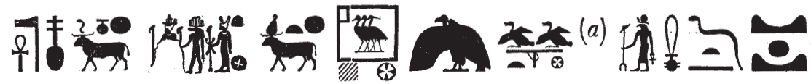
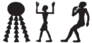
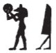

## Esna 164 {-}

- Location: Column B, Lower Bandeau
- Date: Domitian
- [Hieroglyphic Text](https://www.ifao.egnet.net/uploads/publications/enligne/Temples-Esna002.pdf#page=355){target="_blank"}
- Bibliography: None.

#### Esna 164 A {-}

{width=70%}

| *ʿnḫ nṯr nfr  *
| *wbn tȝ-sn.t  *
| *sḥḏ ḥw.t-bȝ.w  *
| *mk ỉȝ.t-ṯȝ.wy  *
| *mỉ Rʿ ḏ.t nḥḥ  *

| Live the good god,
| who shines [^fn-164-1] (over) Esna [^fn-164-2],
| who illumines [^fn-164-3] the Temple of the Bas,
| who protects the Nome of the Chicks,
| like Re, for all eternity.

[^fn-164-1]: For similar spellings of *wbn* featuring a ram, cf. @klotz-baboons, p. 34, n. b.

[^fn-164-2]: Heka writes *tȝ*, "earth", since he wears the special crown of Geb (@klotz-baboons, pp. 50-51, n. b; for Heka-Geb, see @klotz-baboons, p. 40). Sobek writes *s* via acrophony; cf. also [Esna 185 A]. Similar writings of Esna with Geb, Sobek, and Neith occur in *Esna* III, 318, 11; IV, 463, S; 464, N; 465, N; cf. also *Esna* III, 378, 23; IV, 461, S (just Geb and Neith). @kurth-1, p. 533, n. 4, suggested some of these examples cannot derive from Sobek, since the crocodile looks more like Shemanefer, but the distinction is dubious since Shemanefer himself is often called "Sobek." <!--is this true?-->

[^fn-164-3]: *s(r)*, "ram" + *ḥḏ*, "white crown". This spelling echoes *wbn* at the beginning of the text.

#### Esna 164 B {-}

| *nsw.t-bỉty   *
| *nfr [...]  *
| *[...] m ms.w  *
| *wȝḏ zȝṯ   *
|   *m pr=f   *
| *[...] tȝ.wy nb   *
|   *m nfrw=f  *
|
| King of Upper and Lower Egypt,
| good [...]
| [...] in products,
| the earth becomes green 
|   when he comes forth,[^fn-164-6]
| all lands [...]
|   through his perfection.

| *nb bỉȝy.t   *
| *sr ỉỉ  *
| *ỉty wr m-m nṯr.w nb  *
| *ḥʿʿ ḥʿʿ.tw n mȝȝ=f  *
| *ḥkȝ  *
| *ḥqȝ m Bȝq.t  *
|
| Lord of wonders, 
| who foretells [^fn-164-4] what will come,
| great sovereign among the gods,
| lord of rejoicing,
|   one rejoices to see him:
| Heka ({width=20%}):[^fn-164-5]
| ruler in Egypt.

[^fn-164-6]: The same epithet occurs in the litany to Heka, *Esna* III, 242, 25 (75), the first indication this entire text is about him (see below).

[^fn-164-4]: {width=8%} - The spelling of this participle is notable, Anubis playing a tambourine, iconography discussed by Ritner and Von Lieven. This apparently derives from s(h)r, to "strike a drum" (>>refs>>), and relates to the phrase sr-biAy.t, "to foretell wonders", used in a musical sense (ref. to H.G. Fischer). In his litany, Heka is similarly "lord of wonders" and "he who foretells what will come to pass (*sr ḫpr*)" (Esna III, 242, 18 (19)-(20); cf. also *Esna*)
<!--to do: add refs. to Ritner, Von Lieven; check LGG and PWL for sr,shr-->.
[^fn-164-5]: *ḥ* < *ḥȝy*, "to shine" (@sauneron-8, p. 160); *kȝ* < *qȝ*. The same spelling of Heka occurs in *Esna* III, 242, 20 (33), shortly before the same epithet as here, "one rejoices to see him": *Esna* III, 242, 20 (34); the signs are inverted in *Esna* III, 242, 22 (48).
