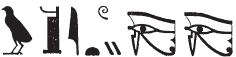

## Esna 169 {-}  
  
  
  
  
- Location: Column C
- Date: Domitian 
- [Hieroglyphic Text](https://www.ifao.egnet.net/uploads/publications/enligne/Temples-Esna002.pdf#page=359){target="_blank"}  
- Bibliography: None. See minor references in [Tempeltexte 2.0](http://www.tempeltexte.uni-tuebingen.de/portal/#/text-detail/815){target="_blank"}    

  

^1^ *nṯr nfr  *  
*wṯz ḥr.t n mw.t=f  *  
*m s.t=ỉb=s  *  
*mỉ šw ḥr wṯz p.t  *  
*(ḥr) sqȝ s.t-Rʿ*   
*n mw.t-Rʿ  *  
*r wnwn ỉm=s  *  
*ḥr rnm ỉfd.w=s  *  
*(ḥr) smn zḫn.w ẖr=s  *  
*ḥr wȝḥ=s n rn=s*  
*mỉ mr.t ẖr [ỉwn-ḥʿʿ...]   *  

*[...]=s ḫnt nṯr.w  *  
*gȝw ỉr.t nb.w   *  
*n snḏ=s  *  
*dḫn.n=f sḫm n mw.t=f wsr.t  *

^1^ The good god,  
who elevates heaven for his mother,  
in her favorite place,  
like Shu, elevating[^fn-169-1] the sky,  
lifting up the Place of Re   
for the Mother of Re,  
in order to move about therein,  
supporting its four corners[^fn-169-2],  
establishing the supports beneath it,  
making it endure for her name [^fn-169-3],  
like the sky bearing [the moon].[^fn-169-4]  
  
[...] her [...] among the gods(?),[^fn-169-5]  
(Since) all eyes are stunned[^fn-169-6]  
from fear of her:  
he concealed the image of his mighty mother.  

[^fn-169-1]: {width=20%} - Unique spelling with acrophonic *w* < *wȝḥ* (cf. @sauneron-8, p. 183).
[^fn-169-2]: {width=8%}{width=8%} - Notable spelling.
[^fn-169-3]: See the correction to the printed hieroglyphs in @sauneron-2, p. i.
[^fn-169-4]: Restored after a similar phrase in *Esna* II, 30, 2.
[^fn-169-5]: {width=10%}{width=15%} - The crocodiles could write something else, but presumably this is an epithet about Neith's "power/prestige/respect" being great among the gods.
[^fn-169-6]: For the spelling of this verb at Esna, see @sauneron-61, pp 240-241.

  

^2^ *ỉwn pn *  
*(ḥr) dwn ẖr s.t=k  *  
*ẖnmw ỉwn n ʿnḫ  *  
  
This pillar (*ỉwn*),[^fn-169-7a]  
extends (*dwn*) beneath your place,  
Khnum,[^fn-169-7] air-pillar (*ỉwn*) of life.   

[^fn-169-7a]: The following text identifies the papyriform columns of the pronaos with various types of plants, primarily papyrus or other reeds. There are many examples of alliteration.
[^fn-169-7]: {width=25%} - Spelling of Khnum.

 

^3^ *šnʿ pw štȝ  *  
*r ḫft-ḥr=k  *  
*šdỉ nnw=f (?) m* ^4^ *sšn  *  
*m wbȝ=k  *  
  
This capital (*šnʿ*)[^fn-169-8a] is remote (*štȝ*)  
from your temple dromos (*ḫft-ḥr*),  
you who raises (*šdỉ*) his child(?)[^fn-169-8] from a lotus (*sšn*)  
in your forecourt.  

[^fn-169-8a]: {width=10%} - This term does not appear to be in dictionaries, but seems to designate a column capital; it also occurs in [Esna 162], 5. Perhaps related to *šnʿ*, "storm cloud" because of its appearance?
[^fn-169-8]: {width=25%} - Uncertain. The preceding spelling of *ḫft-ḥr* with a child suggests the present reading.

 
*wȝḏ pf *  
*wn=k* ^5^ *m-ḫnt=f  *  
*wȝḏy.t wbn.tw *  
*m* ^6^ *wp.t=k  *  
  
This papyriform pillar (*wȝḏ*),  
in which you are (*wn*),  
Wadjet (*wȝḏy.t*) shines (*wbn*)[^fn-169-9]  
on ^6^ your brow (*wp.t*).  

[^fn-169-9]: {width=25%} - Notable spelling of *wbn*.

 
*ṯwf pw  *  
*ṯȝy ỉb=k  *  
^7^ *ṯȝ.wy=f mn(.w) ḥnʿ=k  *  
*ȝḫȝḫ.tw m rw.t-dỉ-mȝʿ.t=k  *  
*wȝḏwȝḏ.w m bȝḥ=k  *  
*ṯḥn.tw [...] n ḥr=k  *  
  
This papyrus plant (*ṯwf*),  
which seizes (*ṯȝy*) your heart,  
^7^ your children (*ṯȝ.wy*)[^fn-169-10] stay with you,  
flourishing in your forecourt,  
verdant before your,  
scintillating [...] in your presence.  

[^fn-169-10]: {width=28%} - Notable spelling.

*ȝḫy pf  *  
*ȝḫ.tw m ỉb=k  *  
*ršw [nṯr.w?]  *  
*[n] dgȝ=f  *  
^8^ *hrw ḥr=k  *  
*r mȝȝ šnw=f   *  
*ṯḥn=f wḏȝ.ty=k  *  
*m rnp.w r ḥn.ty  *  
  
This papyrus thicket (*ȝḫy*),  
is excellent (*ȝḫ*) in your heart,  
the [gods?] delight    
[from] seeing it,  
^8* your face is happy  
from seeing its flowers,[^fn-169-11]  
it scintillates your *wedjat*-eyes,[^fn-169-12]  
with fresh plants for the future.  

  

[^fn-169-11]: {width=15%} - This word occurs several times. It appears to be the normal word "tree", but the determinative suggests general flora; as below, line 9. In *Esna* III, 392, 20, it appears to be part of a tree that shakes with Khnum's force (@sauneron-5, p. 203, left this word untranslated).
[^fn-169-12]: {width=25%} - Unique spelling. The expected *w*-coil in *wḏȝ* seems to have been confused with as the similarly shaped *wṯz* sign. Compare this spelling from *Esna* IV, 413, 3: {width=30%}. Cf. @sauneron-2, p. xxxv.

 

*[...]ḥy pf  *  
*ḥʿʿ=k n ḥpt=f  *  
*ḥn[...]k  *  
*ḥngg=k m ḥzw.t=f  *  
*ḫnmw=f nḏm  *  
*ʿšȝ[..]=f  *  
*rnp.w wr[...] sw *  
*nỉ rḫ ṯnw=sn  *  

^9^ *ḥtp.w=f mỉ ȝḫ.t  *  
*hrw wȝḏ  *  
*šmȝ.w=s nb.w  *  
*ḥr wp šnw=sn  *  
*ȝḫȝḫ=sn m wbȝ=k  *  
*rʿ nb  *  
*ḫntš ỉb=k  *  
*ḥr ḥpt=f  *  
  
This [...]*ḥy*,  
you rejoice (*ḥʿʿ*) to embrace (*ḥpt*) it,  
you hurry(?) [...],  
and you sing (*ḥngg*) from its encounter (*ḥzw.t*).  
Its smell is sweet,  
its [...] are numerous,  
fresh plants are great [...] it,  
one cannot know their number.    
  
^9^ Its plant offerings (*ḥtpw*) are like the field  
on a green day (*hrw*);  
all of its flowers  
are opening up their blossoms[^fn-169-13],  
they flourish in your forecourt,  
every day,  
your heart rejoices  
to embrace (*ḥpt*) it.

[^fn-169-13]: {width=25%} - Apparently the same word as above, line 8.

 
*sʿr pw  *  
*sṯỉ m ṯḥn  *  
*šbn m ḥrr.w nb.w  *  
*šnỉ.w-tȝ nb.w  *  
*pr m ḥʿpỉ  *  
  
*snṯ=f ʿšȝ  *  
^10^ *ỉw=f ḫnty n sbt.wt  *  
*rmṯ nb.w sšȝ(.w)   *  
*m sḫr.w=f  *  
*snḏ=f m ỉb=sn  *  
*zȝ=sn r mȝȝ bȝw=f  *  
*ȝw-ỉb=k m sbt.wt=f  *

This papyriform plant (*sʿr*),  
is strewn (*sṯỉ*) with fayence,  
mixed (*šbn*) with all flowers,  
and all plants (*šnỉ-tȝ*)  
that come forth from Hapi.  
  
His foundation (*snṯ*) is numerous,  
^10^ it is preeminent in flowers (*sbt.wt*),  
all people are aware (*sšȝ*)  
of his plans/status (*sḫr.w*),  
fear (*snḏ*) of him is in their hearts,  
they guard (*zȝ*) against seeing his power:  
May you delight with its flowers (*sbt.wt*)!  

 

*twȝ=sn m twȝy.t  *  
*ḫy=sn m ḫy.t  *  
*fȝỉ=sn m fȝy.t  *  
*ẖr nb=[sn]  *  
*mỉ ḥḥ ḥr wṯz nw.t  *  
  
Their support is Tuayet,[^fn-169-14]  
their raising is Khayet,  
their carrying is Fayet,  
bearing [their] lord,[^fn-169-15]  
like Heh, supporting the sky.  

[^fn-169-14]: These divinized supports of the sky, each identified with a cardinal direction, are also listed in *Esna* II, 17, 48-49; [Esna 183], 7-9; cf. @pichel, pp. 123, 129-130 (with notes). 
[^fn-169-15]: {width=25%} - Restoration based on a similar passage in [Esna 183], 8. 