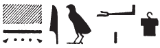

## Esna 170 {-}  
  
  
  
- Location: Column C  
- Date: Domitian  
- [Hieroglyphic Text](https://www.ifao.egnet.net/uploads/publications/enligne/Temples-Esna002.pdf#page=360){target="_blank"}  
- Bibliography: @sayed-neith, p. 639, Doc. 1035.  
  
  

  
  
^11^ *N.t wr.t mw.t-nṯr *  
*nb.t tȝ-sn.t  *  
*ỉt-ỉt.w mw.t-mw.wt  *  
*štȝ.t ʿȝ.t šȝʿ(.t) ḫpr   *  
  *m ḥȝ.t  *  
*bẖ ỉtn *  
*sḥḏ tȝ (r)-ḏr=f  *  
    
*ỉr=s s.t=s m tȝ-sn.t  *  
  *m tȝ-šmʿ  *  
*(ḥr) dỉ(.t) ỉḫt nb r s.t [...]  *  
*[...] tȝ r ʿ=s   *  
*grg tȝ.wy nb (ẖr) s.t-ḥr=s  *  
*wbn šww ỉm=s  *  
  *m snn=s n štȝ.t  *  
  
^11^ Neith the great, Mother of God,  
Lady of Esna,  
father of fathers, mother of mothers,  
great womb who started creation   
  in the beginning,  
who bore the sundisk  
and illumined the whole earth.  
  
She makes her seat in Esna  
  in Upper Egypt,  
giving all things to [their] places,  
[...] the earth is at her disposal,[^fn-170-1]  
all lands are founded (under) her supervision,  
the sun rises from her,  
  in her form of the Mysterious sky. [^fn-170-2]  
  
  
  

  
  
[^fn-170-1]: {width=20%}. Assuming this is a variant of *ḥr-ʿ* or *ẖr-ʿ* (*Wb* I, 156, 22-23; 157, 3, 11), rather than *r-ʿ*, "beside" (*Wb* I, 156, 16 and 19).  
  
[^fn-170-2]: This celestial epithet, not in the Wb, occurs elsewhere in [Esna 107], 1; *Esna* III, 372, 15; *Esna* VI, 536, 2; *Esna* VII 554, 2; 603, 6. From the present context, it is most likely related to *štȝ.t*, "womb" (*Wb* IV, 555, 2-4).  
<!--to do: check LGG for this one-->