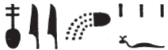

## Esna 176 {-}  
  
- Location: Column D, bottom section  
- Date: Domitian  
- [Hieroglyphic Text](https://www.ifao.egnet.net/uploads/publications/enligne/Temples-Esna002.pdf#page=365){target="_blank"}  
- Bibliography: @sauneron-61, p. 241 (line 9); @klotz-caesar, p. 277, n. e (lines 9-10). Minor entries in [Tempeltexte 2.0](http://www.tempeltexte.uni-tuebingen.de/portal/#/text-detail/826){target="_blank"}  
  
  
  

  

^1^ *nṯr-nfr  *  
*snw n swȝḏ-bȝ  *   
*3-nw n ḥḥ-n-ḥḥ.w  *  
*rmn p.t   *  
*s[ṯz?] s.t-Rʿ   *  
*[...] nḏr ḥḥ.w  *  
   
*šw ḥr twȝ nw.t n ỉt=f  *  
*smn.n=f zḫn.wt *  
*ẖr hȝy.t  *  
*ḥr wȝḥ s(y) n kȝ=f  *  
*mỉ ȝḫ.t wr.t*  
*ẖr dbn.wy  *  
*(ḥr) sqȝ sḫm=f  *  
*ḫntỉ psḏ.t  *  
*dgȝ ḥr.w-nb n bȝw ḥm=f  *  
  
*ḏsr.n=f sštȝ*  
*n ỉt=f šps  * 
  
^1^ The good god,  
second of *swȝḏ-bȝ*,  
third of Heh of Heh-gods,[^fn-176-1]   
who supports the sky,  
who el[evates] the place of Re,  
[...] and grasps the Heh-gods.  
  
Shu is lifting up Nut for his father,    
having established the pillars  
bearing the firmament;  
establishing it for his Ka,  
like the great Akhet  
holding the two orbiters (sun and moon);  
raising up his image,  
foremost of the Ennead:  
all faces see from the power of his majesty.  
  
He made sacred the secret image  
of his august father.

[^fn-176-1]: Two standard epithet of Shu, used particularly in his role of supporting the sky. They are both associated with columns from the pronaos in [Esna 162], 5-6. For *swȝḏ-bȝ*, see *LGG* VI, 210b-c.

  

^2^ *wḫȝ pn *   
*mn(.w) m-bȝḥ=k  *  
*ẖnmw tȝ-ṯnn  *  
*ỉt-nṯr.w  *  
  
^3^ *bȝw.t n ȝḫ-bỉ.t pw  *  
*ʿq=k s(y) m ršw  *  
^4^ *ȝw-ỉb=f *  
*n mȝȝ ỉfd.w=f  *  
     
*ỉw mỉt.t=f   *  
*nty ỉm=f   *  
^5^ *ỉw nty m-ḫnt=f  *  
*ỉrw=f nb n mỉt.t=f  *  
   
^2^ This papyriform hypostyle hall  
is established here before you,  
Khnum Tatenen,  
father of the gods.  
  
^3^ It is the bushes of Chemmis,  
which you enter in joy,  
^4^ your heart gladdens   
to see its four corners.  
  
Its likeness,  
which it is,  
^5^ which is within in it,
all of its forms are of its likeness.[^fn-176-1b]

[^fn-176-1b]: Based on similar passages on other columns (e.g. [Esna 155], 3), this gnomic statement seems to claim that every part of the papyriform hypostyle pronaos at Esna is the exact replica of the marshes of Chemmis.

 

*ʿȝ msḫ.wt(=f)  *  
^6^ *wr sm.w=f  *  
*npry=f ṯḥn.tw  *  
*ẖr ḥrr.w nb  *  
    
^7^ *mnḥ nn   *  
*nnỉ=k m-ḫnt=f  *  
*Mnḥy.t mḥn.t m ḥȝ.t=k  *  
*zbt.wt=f [ṯ]ḥn.tw n ḥr=k  *  
     
*ỉdḥ pfy  *  
*dwn(.w) m-ḥzỉ ḥm=k  *  

^8^ *m.k nbỉ.w=f   *  
*m sšn r fnḏ=k  *  
*ȝw-ỉb=k m ḫnmm=f  *  
*ẖnm=f m sṯỉ=f  *  
*hr-ỉb=k   *  
*n mȝȝ nfrw=f  *  
  
(Its) fields[^fn-176-9] are great,  
^6^ its plants are large,  
its grain[^fn-176-9b] is scintillating,  
containing all flowers.  
  
^7^ This papyrus thicket (*mnḥ*),[^fn-176-10]  
in which you rest,  
Menhyt (*Mnḥyt*) the uraeus (*mḥn*) is on your brow,  
and its flowers [sp]arkle before you.  
  
This papyrus marsh,  
is spread out to meet your majesty.  
  
^8^ Behold[^fn-176-11] its plants!  
namely a lotus at your nose,  
your heart delights from its fragrance,  
you unite with its scent,  
and you are happy  
from seeing its beauty.

[^fn-176-9]: A similar word is recorded in *Wb* II 147, 5, but that appears to be a marsh or body of water. The present term seems to be derived from *sḫ.t*, "field"; see also [Esna 155], 4.
[^fn-176-9b]: {width=15%} - Notable spelling of *npry*, for which one may compare the Coptic derivative ⲛⲁⲫⲣⲓ. Similar spellings are attested as early as the First Intermediate Period: cf. @vernus-form; and see also [Esna 155], 4.
[^fn-176-10]: A number of these plant names occur in the similar dedication text ([Esna 183]), as well as a longer scene of offering papyrus: *Esna* III, 292, 23-24; @sauneron-5, p. 140.  For the *mnḥ*-plant, see @sauneron-bifao64, pp. 1-2. 
[^fn-176-11]: {width=10%} - Unique sign, which I assume is a variant of the bed to write *mk*, "to protect."

*psš.t pw  *  
*prḫ.tw m bȝḥ=k  *  
*bẖ ỉyḥ.w=f   *  
*m pẖr* ^9^ *m wḥm  *  
  
*ỉnm=f m nbw  *  
*gȝbw.t=f m ḫsbḏ n mȝʿ.t  *  
*gȝỉ gȝỉ.ty=k   *  
*m pr=k r=f  *  
  
It is a papyrus mat,  
rolled open before you![^fn-176-12]  
Its plants are born  
all around ^9^ and anew.  
  
Its color is gold,  
its leaves are true lapis lazuli:  
your eyes are astonished[^fn-176-13]   
whenever you come to it!  

[^fn-176-12]: For *psš.t*, see *Wb* I, 555, 1. The verb matched to this term via alliteration (*prḫ*) can also mean "to blossom", so one might understand this phrase differently: "it is a *psš*-plant blossoming before you."
[^fn-176-13]: For this passage, and the reading of the terms (*gȝ*, "to stare in astonishment," not *ptr*, "to behold"), see @sauneron-61, p. 241. 

*ỉw=f m zȝ  *  
*ỉw=f wȝỉ(.w) r sȝ.t  *  
*ỉw=f wʿb.w r ỉḫt nb ḏw  *  
^10^ *sfḫ zmȝy.w   *  
*n ỉw r sȝḥ=f  *  
*snb ḫȝy.t  *  
*n swtwt s.t=f  *  
     
*twȝ=sn ỉs   *  
*m snỉ-r ḥr.t  *  
*mỉ šw ḥr wṯz nw.t  *  
*mn.tw ḏd.tw ḏ.t  *
  
It is protected,  
it is removed from impurity,  
it is purified for all evil things;  
^10^ enemies are released  
from whomever comes to reach it;  
sickness is healed  
for whomever makes a pilgrimage to it.  
  
They (the pillars) meanwhile, lift up,  
resembling the very sky,  
like Shu supporting Nut,  
remaining, enduring, eternally.[^fn-176-14]  

[^fn-176-14]: This last section, describing the supportive function the papyriform columns perform, also occurs in the similar text [Esna 183], 9-10.

