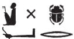

## Esna 177 {-}

- Location: Column D
- Date: Domitian
- [Hieroglyphic Text](https://www.ifao.egnet.net/uploads/publications/enligne/Temples-Esna002.pdf#page=366){target="_blank"}
- Bibliography: @sauneron-1, p. 69.

| ^11^ *[ẖnmw]-Rʿ nb tȝ-sn.t  *
| *Ptḥ ʿḫỉ p.t  *
| *šw twȝ Nw.t  *
| *Iwn [m ỉ]w[d p.t] r tȝ  *
|   *ṯȝw n ʿnḫ (n) nty nb  *
|   
| *ʿḫỉ.n=f p.t ḥr sḫn.w=s  *
| *smn.n=f tȝ ḥr bȝkȝ.wt=f  *
| *sḫpr* [^fn-177-1] *ỉḫt nb   *
|   *m qmȝ n ỉb=f  *
|   
| *ḥḥ pfy twȝ Nw.t  *
| *m ḫprw=f  *
|   *n grg=f tȝ   *
|     *m kȝ.t-ḏbʿ.w=f  *
| *m ỉrw=f n Nḥp  *
|
| ^11^ [Khnum]-Re, Lord of Esna,
| Ptah who lifted up the sky,
| Shu who supports Nut,
| pillar of air [between heaven] and earth,
|    breath of life for all that is.
| 
| As he lifted up the sky upon its supports,
| he established the earth upon its plots,
| he who created all things,
|   as the product of his mind.
|   
| This Heh-god, who supports Nut,
| in his visible form
|   of He founded-the Earth 
|     through the work of his fingers.
| in his form of the Potter.

[^fn-177-1]: Note the unique spelling of *sḫpr*: {width=18%}