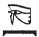

# Column E (180-186) {-}  
  
## Esna 180 {-}  
  
- Location: Column E, Top  
- Date: Domitian  
- [Hieroglyphic Text](https://www.ifao.egnet.net/uploads/publications/enligne/Temples-Esna002.pdf#page=369){target="_blank"}  
- Bibliography: None  
  
  
  
#### Esna 180 A {-}  
  

  
  
^A^ *ỉr p.t   *  
*smn tȝ  *  
*bs Nwn   *  
*sḫpr mn.ty  *  
*ỉr nty qmȝ wnn.t  *  
*ẖnmw grg spȝ.wt  *  
  
^A^ He who made heaven [^fn-180-1],   
established the earth,  
made Nun come forth,  
and created the desert regions,  
who made what is and created what exists,  
Khnum who founded the nomes.  
  

  
  
[^fn-180-1]: {width=10%} - Spellings with the *wedjat*-eye are fairly common.  
  
#### Esna 180 B {-}  
  

  
  
^B^ *ỉȝw rnp r nw=f  *  
*nḫḫ pw ỉr ḥwnw  *  
*ṯȝw n ʿnḫ n nty nb  *  
*ẖnmw sḥḏ tȝ.wy m nfrw=f  *  
  
^B^ Old man who rejuvenates at his time,  
i.e. the elder who becomes a youth,  
breath of life for all the is,  
Khnum who illumines the lands with his beauty.  
  

