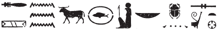
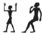
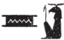
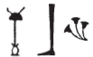

## Esna 183 {-}  
  
  
  
  
- Location: Column E
- Date: Domitian 
- [Hieroglyphic Text](https://www.ifao.egnet.net/uploads/publications/enligne/Temples-Esna002.pdf#page=372){target="_blank"}  
- Bibliography: @sauneron-1, p. 70 (partial); see also [Tempeltexte 2.0](http://www.tempeltexte.uni-tuebingen.de/portal/#/text-detail/834){target="_blank"}    

  

^1^ *[...]*  
*nsw.t-bỉty   *  
*nb tȝ.wy  *  
*(ȝwtwkrtwr kysrs)|  *  
*zȝ-Rʿ nb-ḫʿ.w  *  
*(twmtyns nty-ḫwỉ)|  *  
   
*ỉr.n=f mnw pn nfr  *  
*n ỉt=f šps  *  
*ẖnmw-Rʿ nb tȝ-sn.t  *  
*nṯr ʿȝ ḫnty Iwny.t  *  
*ỉt-ỉt.w mw.t-mw.wt  *  
*ỉr ḥry.w ẖry.w  *  
^2^ *[...]  *  
*nḥb kȝ.w n psḏ.t  *
  
^1^ [...]  
The King of Upper and Lower Egypt,  
Lord of the Two Lands,  
(Autokrator Caesar)|  
Son of Re, Lord of Appearances,  
(Domitian Augustus)|  
  
He made this good monument  
for his august father,  
Khnum-Re Lord of Esna,[^fn-183-1]  
Great god foremost of Esna,  
father of fathers, mother of mothers,  
who made what is above and below  
^2^ [...]  
who assigns Kas to the Ennead.  

[^fn-183-1]: {width=40%} - Note the spelling.

  

*nṯr pn mdw=f*  
*n nṯr.w-nṯry.t nb  *  
*ỉmy.tw tȝ-sn.t  *  
*ḏȝḏȝ.t ʿȝ.t ḫnt ḥw.t-bȝ.w  *  
    
*sḏm=tn nfr  *  
*mȝȝ=tn ȝḫ.w  *  
*ỉr n=ỉ zȝ=ỉ  *  
*ḥry-ns.t=ỉ  *  
*wtṯ=ỉ   *  
*pr ỉm=ỉ   *  
^3^ *[...]  *  
*[...Tni s]w ḥr msḫn.t  *  
*stp n nṯr  *  
*ȝbḫ(.w) m ḥḥ  *  
*swr s.t=f ḫnt ḥfn.w  *  
*ỉwʿʿ mnḫ  *  
*mry nṯr.w Bȝq.t  *  

*dhn.tw=f  *  
*r ḥqȝ psš.ty  *  
*ỉr.n Rʿ m nswy.t ḥr-tp tȝ   *  
*(n) mrw.t grg tȝ pn  *  
  
This god speaks  
to the all the gods and goddesses  
that are within Esna,  
the great assembly within Temple of the Bas.    
  
May you listen well,  
may you see the excellent things  
my son has done for me,  
my successor,  
whom I begot,  
who came forth from me  
^3^ [...]  
[distinguished h]im upon the birth-brick,  
chosen by god,  
united with Heh,  
whose place was magnified among millions,  
beneficent heir,  
beloved of the gods of Egypt.  
  
He was appointed   
to rule the Two Shares (Egypt),  
made king by Re upon earth,  
in order to settle the land.  

  

*ẖnmw n ỉdb.w  *  
*smȝwỉ wȝsỉ  *  
*mḥ gm-wš   *  
^4^ *[...]  *  

*[...]=sn  *  
*smȝwy.n=f ḥw.t-nṯr=sn  *  
*nḏ-rȝ ḥr r-pr=sn  *  
*sḫnt nỉw.t=sn  *  
*swr spȝ.wt=sn  *  
*ḏsr ỉȝ.t=sn  *  
*ẖr ʿḫm.w=sn  *  
  
Khnum[^fn-183-2] of the shores,  
who renews what is ruined,  
who fills what is found missing,  
^4^ [...]  
  
[...] their [...],  
having renewed their temples,  
(he) who protects their domains,  
who advances their cities,  
who magnifies their districts,  
who sanctifies their mounds  
bearing their sacred images.  

[^fn-183-2]: {width=10%}{width=10%} - The king receives this epithet in his role of a builder who restores temples.

  

*nbỉ.n=f nbw.t   *  
*n nb nḥp=f  *  
  
*sȝḫ.n=f ȝḫ   *  
*n sḫt-šzp=f  *  
   
*sʿr.n=f sʿr  *  
*n sr ʿȝ  *  
    
^5^ *[ṯz].n=f [ṯwf]  *  
*n ṯȝ.wy n Rʿ  *  
    
*sʿr.n=f ʿr   *  
*n sr wr  *  
  
*sš.n=f s.t-ḫnt  *  
*n zmȝ-mȝʿ.t  *  
    
*ḫnty(.n=f) ḫnty  *  
*n ḫnty ḫnt-tȝ  *  
    
*sqȝ.n=f qȝy  *  
*n qdỉ-qdỉ.w  *  
    
*ʿr.n=f ʿr  *  
*n rrỉ-rr.wt  *  
    
*ḫy.n=f nḥb(.t)  *  
*n ẖnmw ỉr ẖnm.w  *

He fashioned a golden column,[^fn-183-3]  
for Lord of his Potter's Wheel.  
  
He transfigured a papyrus column,  
for He who Weaves his Light.  
  
He elevated a papyriform column,  
for the great ram.  
  
^5^ He [raised up] a [papyrus plant][^fn-183-4]  
for the children of Re.  
  
He elevated a plant column,  
for the great ram.  
  
He opened up a place of a canal,  
for the Companion of Maat.  
  
He promoted a *ḫnt*-plant,[^fn-183-5]  
for Foremost of Khent-ta.  
  
He raised up a tall plant,  
for the Builder of BUilders.  
  
He elevated a reed,  
for the Nurse of Nurses.  
  
He raised up a lotus column,[^fn-183-6]  
for Khnum who made the Khnums.  
  

[^fn-183-3]: In this section, the distinctive columns are likened to papyri and other plants, just as in [Esna 162] and [Esna 169]. Like those other texts, there is very heavy use of alliteration here, and I will not point out every example. Most of the gods are epithets of Shu or Khnum, the local version of Shu, appropriate for supporting the temple roof.  
[^fn-183-4]: Restored based on alliteration, and a similar combination in [Esna 169], 6-7.
[^fn-183-5]: A very rare word for a plant, recorded once in Papyrus Vandier (*TLA* Lemma-No. 600444).
[^fn-183-6]: This term for a column occurs in a dedication inscription of Amenhotep III from Luxor Temple: *Wb* II, 294, 4.

*smn.n=f wbȝ  *  
^6^ *wȝrḫ(.w) ẖr wḫȝ.w  *  
*sḥd.tw mỉ p.t ẖr Rʿ  *  
   
^7^ *ḫy=sn ḫy(.t)  *  
*fȝy=sn* ^8^ *m fȝy(.t)  *  
*ẖr nb=sn   *  
*nn nnỉ nn sk  *  
^9^ *twȝ=sn ỉsk  *  
*m snỉ-r p.t  *  
*mỉ šw ḥr wṯz* ^10^ *nw.t  *  
   
*mn.tw ḏd.tw rwḏ.tw  *  
*mỉ zḫn.w ẖr ḥr.t  *  
  
Thus he established the floral forecourt,[^fn-183-7]  
^6^ flourishing with papyriform columns,  
shining like the sky bearing Re.  
  
^7^ They (The columns) support as Khayet,  
they lift ^8^ as Fayet,[^fn-183-8]   
bearing their lord,  
without tiring or fail.  
^9^ They raise meanwhile  
resembling the sky,  
like Shu lifting up ^10^ Nut.  
  
They remain, endure, are strong,  
like the supports underneath heaven.

[^fn-183-7]: {width=10%} - From the context, this must refer to the pronaos. The determinative shows this space has been transformed conceptually into a collection of plants and flowers.
[^fn-183-8]: These two goddesses, half of the divinized four "supports" of the sky, are also mentioned in [Esna 169], 10.