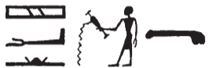
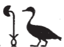
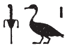
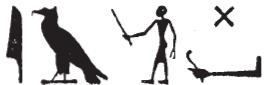
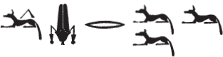
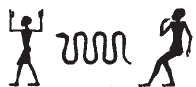
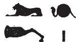

## Esna 184 {-}  
  
  
  
  
- Location: Column E
- Date: Domitian 
- [Hieroglyphic Text](https://www.ifao.egnet.net/uploads/publications/enligne/Temples-Esna002.pdf#page=373){target="_blank"}  
- Bibliography: See [Tempeltexte 2.0](http://www.tempeltexte.uni-tuebingen.de/portal/#/text-detail/835){target="_blank"}    
- Parallels: Multiple similar sequences in *Esna* II, 17.

NB: This single hymn touches on a wealth of Egyptian cosmogonic and cosmographic traditions, in addition to details of theology specific to Esna. An entire book could be written finding parallels throughout the temple, and making comparisons to other sources. The following notes are minimal, highlighting only difficult or notable spellings. 

^11^ [...]  
[...] *nt* ^12^ *ỉt ḏfn  *  
*šȝʿ sṯỉ  *  
*wsn ỉr nḏmnḏm  * 
  
^13^ *[ỉtn?] wr  *  
*wbn m nw.t  *  
*sḥḏ.n=f tȝ.wy*  
*m ȝḫ.ty=f   *  
^14^ *šww m hrw  *  
*ỉʿḥ m grḥ  *  
*wnm.t=f ỉȝbt.t=f  *  
*(ḥr) sḥḏ tȝ.wy  *  
    
^15^ *ỉỉ m ḥʿpỉ  *  
*ỉwḥ ȝḫ.t  *  
*sḫpr.n=f wnn.t nb  *  
  
^11^ [...]  
[...] of ^12^ the ancestor father,  
who began procreation,[^fn-184-0]  
the lusty ram who makes sexual pleasure.  
  
^13^ The great [sundisk?],  
who shines in the sky,  
having illumines the two lands  
with his two luminous eyes:  
^14^ Sun during the day,  
moon at night,  
his right and left eyes  
illumine the two lands.  
  
^15^ He who arrives as Hapi,  
and floods the field,  
thus he created all that exists.  

[^fn-184-0]: {width=15%} - The hieroglyph of the man pouring water traditionally wrote *sṯỉ mw*, "to pour water", or the related title *s(t)m*, "Sem priest": @volokhine-qasr, pp. 421-422.  A similar epithet for Khnum in *Esna* II, 17, 6 (*šȝʿ wtṯ *).

    
*ms nṯr.w  *  
*ỉr nṯr.w   *  
*ḫpr ḏs=f   *  
*ỉwty ms.tw=f  *  
*pr *  
*nn qmȝ ỉrw=f  *  
*nn ky ḫpr ḥȝ.t=f  *  
    
*ỉt=sn pw   *  
*qmȝ ḥʿw=sn  *  
*qdỉ.n=f nṯr.w  *  
*nḥp.n=f nṯr.yt  *  
*sḫpr.n=f ṯȝy.w ḥm.wt  *  
*pȝy.w ḫny.w  *  
*ỉʿw.t mnmnm.w  *  
*ḥrr.w nb mỉt.t  *  
    
*ỉt=sn pw ḫws=f  *  
*šȝʿ qmȝ=sn  *  
*pr=sn ỉm=f r-ȝw  *  
  
*pȝwty pw*   
*ỉr nn r-ȝw  *  
*ms nty nb  *  
*[...]  *  

^18^ *ʿḫỉ p.t  *  
*smn tȝ  *  
*ỉr mw  *  
*sḫpr Mḥ.t-wr.t  *  
*ỉr kȝ.w *  
*sḫpr nḏmnḏm  *  
  
He who birthed the gods,  
who made the gods,  
who came about by himself,  
without one who could birth him.  
He who came forth,  
without one to create his form,  
without anoter who came about before him.  
  
He is their father,  
who created their bodies:  
as he built the gods,  
he modelled the goddesses,  
he created men and women,  
birds and fish,  
small and big livestock,  
and all creeping things likewise.[^fn-184-1]  
  
Their father as he builds,[^fn-184-2]  
who began their creation,  
all of them came forth from him.  
  
He is the primeval one,  
who made all this,  
who birthed all that is.  
[...].  
  
^18^ He who lifted up the sky,  
and established the earth,  
who made the water,  
and created[^fn-184-3a] Mehet-weret,[^fn-184-3]  
who made bulls,  
and created sexual pleasure.

[^fn-184-1]: Similar texts in *Esna* 250, 7, 14-15 (creation of gods and all species); and in more detail *Esna* II, 17, 25-39.
[^fn-184-2]:  {width=10%} - A similar spelling occurs in *Esna* II, 16, 1:  {width=10%}. Based on an epithet in a similar context from *Esna* 250, 7 ({width=20%}), this seems to be a participle *ḫwsỉ*, "the builder," that calls to mind the phrase *ḫw-zȝ*, "he who protects the son", as well as composite spellings of the goose (*r*) holding the papyru plant (*ḫ(ȝ)*)in its mouth for *rḫ*, "to know" (cf. @sauneron-2, p. xxxi).
[^fn-184-3a]: Mehet-weret was a manifestation of Neith, so is this hymn suggesting Khnum actually created Neith?  Or is he just responsible for creating her later hypostasis? In *Esna* II, 11, 17, the related god Amun-Re is said to have "first created the Great Cow (*šȝʿ ỉh.t wr.t*)."
[^fn-184-3]: {width=18%} - Similar spelling of Mehet-weret occur in *Esna* II, 16, 2; and [Esna 58], 2. The hymn seems to be proceeding via word association: the creation of water brings to mind Methyer, the primeval cow swimming before land was created. This sacred cow evokes bulls and procreation in the following verses.

*ỉnḏ[-ḥr]=k  *  
*ỉn nṯr.w p.t  *  
*zmȝ.n=k nw.t  *  
   
*dwȝ tw=k ḫȝbs.w   *  
*ỉmỉ.w nn.t  *  
      
*[swȝ]š tw=k ỉḫm.w-wrḏ.w  *  
*dwȝ tw=k* ^19^ *ỉḫm.w-sk.w  *  
*Rʿ n=k m ỉȝw  *  
*ỉmỉ.w wỉȝ=f *  
*m nỉnỉ [n ḥr]=k  *  
     
*ms.w ḥr tȝ-wr   *  
*ḥr swȝš ḥm=k  *  
*ỉmn-wr ḥr dwȝ kȝ=k  *  
      
*ntk wbn *  
*sḥḏ.tȝ.wy  *  
*pẖrr nfr [...]  *  
*[...]* ^20^ *ȝḫ.t  *  
*wpš ỉȝbt.t m nqr  *  
      
*wḥm-ʿnḫ   *  
*wḥm.n=f rnp  *  
*r sḥḏ tȝ (r)-ḏr=f  *  
*wn m kkw zmȝw  *  
      
*nb nṯr.w rmṯ pw  *  
*ḥqȝ tȝ.w nb.w  *  
  
'Greetings [to] you!'  
say the gods of heaven,  
after you have joined the sky (*nw.t*).  
  
The decan stars praise you,  
those who are in the nethersky (*nn.t*).  
  
The indefatigble stars [worsh]ip you,  
the imperishable ^19^ stars praise you,  
Re is in praise to you,  
those who are in his solar bark  
make *nỉnỉ*-gestures [to] you.  
  
Those born in the west  
praise your majesty,  
those on the east praise your Ka.  
  
You are the shiner,   
who illumes in the to lands,  
the great encircler [...]  
[...] ^20^ the Akhet,  
who brightens the East in gold dust.  
  
He who repeats life,  
having repeated rejuvenation,  
to illumine the entire land,  
which was in utter darkness.  
  
He is the lord of gods and men,  
ruler of all lands.

*mnỉw nfr n nṯr.w nṯry.t  *  
*[...]  *  
^21^ *spd sḫr.w  *  
*nb mrw.t ẖr šw.ty wr  *  
    
*nb sḫ.t pw *  
*ḥsb ḫt-mn  *  
*rdỉ ḥtp.w-nṯr.w  *  
*n nṯr.w rmṯ  *  
*nb ʿbw ḥtp ḥr twr  *  
*ḥtp=f ḥr ỉr(.t) mȝʿ.t  *  
  
*twȝ.n=f p.t hr zḫn.wt=s  *  
*wṯz=f sy m ḥḥ  twȝ nw.t  *  
*dỉ=f sw ẖr=s   *  
*m ỉwn wr  *  
*šw ẖr p.t  *  
*kȝ.tw r=f  *  
   
^22^ *ʿrq.n=f rnp.wt  *  
*km.n=f wn.wt  *  
*ṯnỉ=f grḥ  *  
*r zbỉ n=f hr.w  *  

*sšȝ.n=f ȝbd(.w) nb.w  *  
*wḥm.n=f ms.wt mỉ Rʿ  *  
*ḥʿʿ.tw m ỉwn-ḥʿ  *  
*tp ȝbd.w  *  
*sšm.n=f ḥb.w nb.w  *  
*r tp-tr.w  *  
   
Good herdsman[^fn-184-4] of gods and goddesses,  
[...]  
^21^ sharp of plans,  
lord of love with the great double plumes.  
  
He is the Lord of the Field,  
who reckons the entire world,  
who gives divine offerings  
to gods and people,  
lord of purity, who deligts upon cleanliness,  
he is happy from performing Maat.  
  
He raised up the sky upon its supports,  
he lifts it as Heh who supports the sky (Nut),  
he places himself under it,  
as the Great Air-Pillar,  
'Shu under the Sky'  
he is also called.  
  
^22^ As he finished years,  
so he completed hours,  
and he meters out the night,  
so the days might run for him.  
  
He makes apparent all months,  
having repeated births like Re,  
rejoicing as the rejoicing-pillar (moon),  
every month,  
having guides all festivals  
at the proper times.  

[^fn-184-4]: {width=18%} - The reading seems certain, but the typical ideogram that begins this word (the man holding a stick) seems to have been interpreted here as a determinative: cf. *Esna* III, 261, 18 (13); 368, 32. Similar spellings occur in [Esna 190], 8 and 10.

*bs.n=f ḥʿpỉ r sw=f  *  
*swȝḏ.n=f ȝḫ.t r dmḏy.t=s  *  
*srwḏ.n=f* ^23^ *sm.w  *  
*ḥrr.w nb.w  *  
*ḥnʿ pr.t nb.w  *  
*rr.n=f nprỉ  *  
*m tp n tmȝ.t=sn  *  
   
*ỉr.n=f ḫ.t-n-ʿnḫ   *  
*n ʿnḫ.w nb.w  *  
*pr=f m ṯȝw   *  
*r ẖnmm.ty ḥnʿ ẖ.t  *  
*ẖnm.n=f ḥʿw r-ȝw  *  
  
As he made Hapi emerge on his day,  
so he made the field verdant at her time,  
having made thrive ^23^ plants,  
all flowers,  
and all seeds.  
He nurtured the grain  
on top of their mother.  
  
He made the 'wood-of-life'  
for all the living,  
he comes forth as air,  
for nostrils and the belly,  
thus he united with bodies entirely.  

*mỉ m ḥtp  *  
*ḥnʿ bȝ.w-ʿnḫ.w  *  
*ḫntš=k ḥr bw nfr  *  
*ṯȝy.w-ḥm.wt m* ^24^ *ỉhȝy m-bȝḥ=k  *  
*ḥr.w nb ḥr nhm n mȝȝ=k  *  
  
*sʿnḫ=k ỉb.w  *  
*ṯz=k ḥȝty.w   *  
*dr=k ʿnḫ mw.t  *  
*n wn ḥr-mw=k  *  
*ḏd.tw r=f   *  
*ḫy sḫd   *  
  
Come in peace,  
together with the living Bas,  
may your rejoice over good things!  
Men and women are ^24^ cheering before you,  
everybody rejoices to see you.  
  
As you enliven minds,  
so you elevate hearts,  
and you send out life and death  
to whomever is loyal to you.  
Thus he is called:  
'Rise and fall'.[^fn-184-5]

[^fn-184-5]: {width=15%}{width=15%}
  

*bȝ-bȝ.w *  
*šfy-šfy.w  *  
*dgỉ.[n=f] (sw) r rmṯ  *  
*sštȝ.n=f (sw) r nṯr.w  *  

*nb ʿḥʿ   *  
*ḫpr šȝỉ *  
*m km (n) ȝ.t  *  
^25^ *nỉs.tw=f m hrw dmḏ  *  
*rḫ.tw.n=f m ḥr-n-ḥr  *  
*mḥ-ỉb pw n nsw.t  *  
*m rk=f  *  

*bs ḏsr n nṯr-ʿȝ  *  
*s.t=f ḏsr mỉ p.t  *  
*nỉ mỉt.t=s m tȝ-r-ḏr=f  *  
*rdỉ.n=sn n ḥtpty.w  *  
*r ỉmn ḫprw=sn ỉm  *  
*ʿbȝ.t pw n Wsỉr nb-ʿnḫ  *  
*ḥtp kȝ=f* ^26^ *m-ḫnt=s  *  
*ḏd(.w) ẖr bȝ=k  *  
*nn ws ẖr sḫm=k  *  
*mỉ tȝ ḥr-tp bȝkȝ.wt=f  *  
  
Ba of Bas,   
most prestigious of the prestigious,  
as he hid (himself) from people,  
he disguised[^fn-184-6] (himself) from the gods.  
  
Lord of lifetimes,  
Fate (Shai) comes about,  
in the completion of a moment.  
^25^ One calls to him on the day of battle,  
one knows him in a time of danger.  
He is the trusty confident of the king  
during his time.  
  
The august image of the great god.  
his place is sacred like heaven,  
without peer in the whole land.  
They (were?) given to the blessed dead,  
to hide their forms therein.  
  
It is the Abaton of Osiris of Neb-ankh,  
his Ka rests ^26^ within it,  
it endures carrying his Ba,  
without fail carrying his image,  
like the earth upon its foundations.  

[^fn-184-6]: {width=28%} - The *n=f* in the *sḏm.n=f* verbal form are written with the Nefertem emblem, which elsewhere just writes *nfr*. The same occurs in [Esna 162], 4 and 5 (regular *nfr*-sign), as discussed by @sauneron-1, p. 48, n. 1.

*zȝ-Rʿ ḥkȝ pȝ-ẖrd  *  
*mn(.w) ḥr ns.t=f  *  
*p.t m ḥb  *  
*tȝ m mfk  *  
*gs.w-pr.w sṯỉ(.w) m ṯḥn  *  
*tȝ-šmʿ tȝ-mḥw r-ȝw=sn  *  
*m ʿq n kȝ=f  *  
*šfy.t=f pẖr.w m-ẖnw=sn  *  
    
^27^ *ṯȝy.w m hy  *  
*ḥmw.wt m hnw  *  
*ḥnmm.t (ḥr) snỉ-tȝ   *  
*n bȝw=f  *  
  
*sḫm n Rʿ  *  
*qmȝ n šw  *  
*wḥm msḫʿ.w mỉ nb p.t  *  
*nsw.t-nsw.wt  *  
*bỉty-bỉty.w  *  
    
*hȝ.t-nṯr.w  *  
*pḥwy psḏ.t  *  
*ḫpr nṯr.w ḥr-sȝ=f  *  
*ʿḥʿ=f ȝw(.w) m-ḫt=f  *  
  
The son of Re, Heka the Child,[^fn-184-7]  
remains upon his throne.  
Heaven is in festival,  
the land is all turquoise,  
and temples sprinkled with fayence.  
All of Upper and Lower Egypt   
are in great festival for his Ka,  
as his prestige circulates among them.  
  
^27^ Men do the *hy*-dance,  
women do the *hnw*-dance,  
the sunfolk kiss the earth  
for his Bau-power.  
  
The image of Re,[^fn-184-8]  
created by Shu,  
who repeates birth like the Lord of Heaven,  
*nsw*-king of *nsw*-kings,  
*bỉty*-king of *bỉty*-kings.  
  
The beginning of the gods,  
the end of the Ennead,  
the gods came about after him,  
and his lifetime extends after him.  

[^fn-184-7]: {width=10%} - This spelling of Heka's name occurs regularly in ornamental friezes on the tops of columns.
[^fn-184-8]: {width=10%} - Notable spelling of "Re", appropriate for his physical image (*sḫm*); also occurs in [Esna 155], 1; [Esna 191], 13; *Esna* III, 206, 10 §14.

*ỉw n=f ỉmy.w p.t  *  
*r nḏ(.t) ḫt  *  
*m-rwty s.t=f  *  
^28^ *nṯr.w ṯȝy.w  m ksw*   
*n snḏ=f  *  
*nṯry.t n=f   *  
*(ḥr) ỉr(.t) sšš n ḥr=f  *  
  
*nhm n rn=f  *  
*tȝ-sn.t m ḥb  *  
*Iwny.t m ršw  *  
*ḥw.t-bȝ.w m ḥʿʿ  *  
*ḥw.t-ṯȝ.wy m ȝw.t-ỉb  *  
*ḥw.t-nṯr=sn bʿḥ.w   *  
*wḥm.n=s šn  *  
*nỉw.t=f m ỉhȝy rʿ-nb  *  
  
Those within heaven come to him  
to consult about affairs  
outside his throne.  
^28^ Male gods are bent down  
in fear of him;  
goddesses are with him,  
performing sistra in his face.  
  
Rejoice in his name!  
Esna is in festival,  
Iunyt is ecstatic,  
Temple of the Bas rejoices,  
Temple of the Chicks is happy,  
their temples are flooded,  
and they have repeated their cycle:  
His city is in jubilation, every day!

