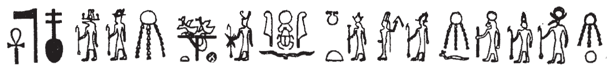

## Esna 185 {-}  
  
- Location: Column E, Lower Bandeau  
- Date: Domitian  
- [Hieroglyphic Text](https://www.ifao.egnet.net/uploads/publications/enligne/Temples-Esna002.pdf#page=376){target="_blank"}  
- Bibliography: @ryhiner-lotus, p. 159 (translation of 185 B)  
  
  
  
#### Esna 185 A {-}  
  
{width=80%}  
  

  
  
^A^ *ʿnḫ nṯr nfr  *  
*sḥḏ ỉȝ.t-ṯȝ.wy  *  
  *mỉ ȝḫ.t n.t P.t  *  
    *m stw.t=f  *  
*(???)  *  
  
^A^ Live the good god,  
who illumines [^fn-185-1] the Nome of the Chicks,  
  like(?)[^fn-185-2] the Akhet[^fn-185-3] of heaven [^fn-185-4],  
    with his rays [^fn-185-5]  
(???) [^fn-185-6]  
  

  
  
[^fn-185-1]: *s* < *Sbk*, "Sobek" (cf. [Esna 164 A]; @kurth-1, p. 163, n. 573); *ḥḏ* < "white crown".  
  
[^fn-185-2]: Presumably: *mỉ* < *mw.t(-nṯr)*, "mother of god", a frequent epithet of Neith (@kurth-1, p. 165, n. 656). Compare spellings of *mw.t* as *mỉ*: @klotz-philae, pp. 81-82, n. 27.  
  
[^fn-185-3]: The composite sign, showing Khepri emerging between two feathers (west and east) with the solar disk, is an apt depiction of the Akhet, and reminiscent of a special crown the king offers Khnum in *Esna* VI, 512, and which Heka the child wears during the divine birth festival on [Pachons 14]. The same ideographic value for this sign occurs in *Esna* III, 379, 24; 396, 16 (confirmed by a parallel in *Urk* VIII, 18c); *Esna* VII, 586.  
  
[^fn-185-4]: Here Isis writes the word *p.t*, "heaven" (@kurth-1, p. 165, n. 636); *Esna* VI, 524, 7.    
<!--#  Also check out Kurth, GM 19, 1976, 35ff if you can find it, might have other Esna examples. in EP I, only cites Es 24, 13; 405, 1 -->  
  
[^fn-185-5]: *m* < *Mnw*, "Min" (@kurth-1, p. 158, n. 417, to which this example should be added);   
*stw.t* < *St.t*, "Satet" (@klotz-luxor, p. 89, 100).  
  
[^fn-185-6]: These final signs are a mystery to me. Based on similar texts, one would expect this text to conclude with the name of Khnum-Re, but it is difficult at present to reconcile with the signs as recorded in Sauneron's copy.  
  
  
#### Esna 185 B {-}  
  

  
  
^B^ *[ʿnḫ nṯr nfr]  *  
*[...wbn m] nḫb  *  
*sḏty ỉqr n ỉr.t-Rʿ  *  
*ḫmnỉ.w m ỉȝw n ḥr=f  *  
*ḥkȝ pȝ-ẖrd bnr-mrw.t  *  
  
^B^ [Live the good god]  
[...who rises from] the lotus,  
excellent child of the Eye of Re,  
before whom the Ogdoad are in adoration:  
Heka the Child, sweet of love.  
  

