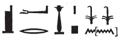

## Esna 190 {-}  
  
  
  
  
- Location: Column F
- Date: Domitian 
- [Hieroglyphic Text](https://www.ifao.egnet.net/uploads/publications/enligne/Temples-Esna002.pdf#page=382){target="_blank"}  
- Bibliography: @sauneron-1, pp. 71-72 (partial translation and summary); see also [Tempeltexte 2.0](http://www.tempeltexte.uni-tuebingen.de/portal/#/text-detail/844){target="_blank"}    

^1^ *sʿr.w nn   *  
*[...]*  
*ḥm=k ẖnmw  *  
*pȝ mnỉ nfr n tpy.w-tȝ  *  
*ỉmy-rȝ ỉḥ.w wr  *  
*ʿšȝ mnmn.w  *  
    
*ṯwf pw*   
*swtwt=k r mȝȝ=f  *  
      
*nḥb=k wrry.t=k  *  
*r ʿq=f m-ẖnw wʿ wḫȝ  *  
*spr=k ȝḫ-bỉ.t   *  
*m km n ȝ.t  *  
     
^2^ *ʿ[q.n]=k pr=k  *  
*m nḏm-[ỉb]  *  
*[...]  *  
  
^1^ This hall of papyrus stalks[^fn-190-1]  
[which are in front of][^fn-190-1b]  
your majesty, Khnum,[^fn-190-2]  
the good herdsman of those on earth,  
Great Overseer of Cattle,  
numerous of livestock:  
  
It is a reed marsh,   
which you travel to behold.  
  
You harness your chariot[^fn-190-3]  
to enter it within a single night,  
and you reach Chemmis  
in the completion of a moment.[^fn-190-4]  
  
^2^ You en[tered] your domain  
in happ[iness][^fn-190-5]  
[...] 

[^fn-190-1]: {width=15%} - This might appear to be *s.t-ʿr.w *, "place of papyriform columns", but the following *nn* suggests we have a plural or collective noun. For the term *sʿr*, "papyrus stalk", see also [Esna 169], 9; [Esna 183], 4; @koemoth-sar, pp. 151-154.
[^fn-190-1b]: For a possible restoration, note the similar introduction to [Esna 155], 1.
[^fn-190-2]: {width=15%} - This trigram evokes the notion of a rising inundation, as well as the harvest month of Shomu.
[^fn-190-3]: {width=35%} - The verb *nḥb*, "to harness", erroneously includes the word *kȝ*, since the first group frequenly occurs in the name 'Nehebkau.'
[^fn-190-4]: An allusion to Khnum traveling between Esna and Chemmis in a single night: cf. @sauneron-1, pp. 71-72, >>sauneron-5?>>.
[^fn-190-5]: Restored after *Esna* III, 249, 4, §22

[...] *wn ỉm=f  *  
*mỉ wn ỉm=f  *  
     
*pẖr(.w) m mw  *  
*ẖr pȝy.w  *  
*ẖnm.t=sn ẖr rm.w  *  
*ȝḫȝḫ.tw m sm.w  *  
*wȝḏwȝḏ(.w) m np(r)y nb.w  *  
   
*ʿpr(.w) m kȝ.t ỉd.wt  *  
*m ḫprw [nb].w n ỉnm  *  
*m ʿw.t[-nṯr] ḥr rn=f  *

[...] which is in it,  
is like that which is in it.  
  
It is surroundwd with water,  
filled with birds;  
their basins contain fish;  
it blossoms with plants,  
it is verdant with all grains.  
   
It is equipped with bulls and cows,  
in [all] varieties of color,  
as animals [for each god],  
by name:[^fn-190-6]  

[^fn-190-6]: Here begins a tedious list of sacred bulls and cows, and the divinities they belong to. This text continues in [Esna 155], [Esna 156], and [Esna 191]. Many of the animal terms are unique, so their precise transliteration is at times uncertain. In the following, I will only translate the names whenever the etymology seems certain. As @sauneron-2, p. 311, n. a, noted, it is dificult to distinguish the bull and cow determinatives; in what follows, I will refer to animals as "cow" or "bull" based on the feminine *t*-ending, which might not be consistent.

^3^ *ḥḏmy.t n Rʿ  *  
*ȝty n gnḥ-Rʿ  *  
*ỉzty.w n Ptḥ nfr-ḥr  *  
*kmy.t n ḥr  *  
*dšr.w n Swtḫ  *  
*rnn.w n Is.t  *  
*mnn.wt n Nb.t-ḥw.t  *  
*tȝy.wt n Tnm  *  
*hkȝy.w n ḥqs  *  
*ẖsy.w n Sḫȝ.t-ḥr  *  
^4^ *wry.t n Sšȝ.t  *  
*gnḥy.w n Gbb  *  
*ỉd.wt n Nw.t  *  
*ṯrḥy.w n ḫnsw  *  
*mḥy.wt n ḫnsy.t  *  
*wḏy.wt n ḫnty-ẖty  *  
*ʿby.w [n ...]  *  
*ʿmy.wt n Bȝ  *  
*rḫ.w n* ^5^ *Rnn.t  *  
*sȝbqy.w n [Sbk?]  *  
*wnš.w n pr m sn.wt  *  
*hȝby.wt n ḥʿpỉ  *  
*nbsy.wt n N.t  *  
*tȝy.wt n nb=f  *  
*ḥqy.w n ḥpḥp   *  
*[...]   *  
*[...] n nb sḫt=f  *  
*ʿbʿb.w n *   
*mȝȝ-ỉn.tw=f  *
^6^ *mnw.w n nṯr.w nb.w  *  
*bḥs.w* ^7^ *(n) nṯr.w ỉmy.w p.t  *  

The *ḥḏmy.t*-cow for Re,  
the *ȝty*-bull for Dark Re(?),  
the *ỉzty*-bulls for Ptah Beautiful of Face,  
the black cow for Horus,  
the red bulls for Seth,  
the young bulls for Isis,  
the *mnn.t*-cows for Nephthys,  
the *tȝy.t*-cows for the Wanderer,  
the *ḥky*-bulls for Heqes,  
the *ẖsy*-bulls for Sekhat-Hor,  
^4^ the great cow for Seshat,  
the dark bulls for Geb,  
the cows for Nut,  
the *ṯRḥy*-bulls for Khonsu,  
the *mḥy.t*-cows for Khonsit,  
the *wḏy.t*-cows for Khenty-Khety,  
the *ʿby*-cows [for ....]  
the *ʿmy.t*-cows for the Ba,  
the smart bulls for ^5^ Renenutet,  
the *sȝbqy  *-bulls for [Sobek?],  
the jackals for He who Comes for Senut,[^fn-190-7b]  
the *hȝby.t*-cows for Hapi,  
tne *nbsy.t*-cows for Neith,  
the *tȝy.t*-cows for His Lord,  
the *ḥqy*-bulls for Hephep  
[...]  
[...] for Lord of *sḫt=f*,[^fn-190-7a]  
the *ʿbʿb *-bulls for    
He who sees his Father,[^fn-190-7]  
^6^ the *mnw*-bulls for all the gods,  
the calves ^7^ (for) the gods within heaven.
  

[^fn-190-7b]: *LGG* III, 82c, only know this examples and [Esna 156], 24.
[^fn-190-7a]: *LGG* III, 741a (only one other attestation).
[^fn-190-7]: *LGG* III, 199a-200b.

   
*mnỉw nn m zȝ n ḥʿw=k  *  
^8^ *m ʿnḫ-ḏd-wȝs  *  
*ʿn n=k ḥpỉ m kmy.w  *  
^9^ *nr.w=k m pr-wr  *  
*mdw=k ḥr tȝ ^10^ ỉty  *  
*zȝ=k mnỉ.w n.w ỉḥ.w ḫȝ.w  *  
  
These herders protect your body,  
^8^ with life, endurance, dominion.  
Apis wails for you with black bulls,  
^9^ and your *nr*-bulls are in the Per-wer.  
You speak upon earth, ^10^ Sovereign:  
may you protect the herders   
of thousands of cattle.  

