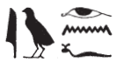
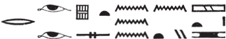
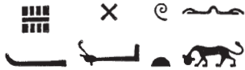
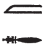
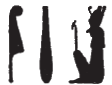
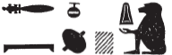

## Esna 191 {-}  
  
  
  
  
- Location: Column F
- Date: Domitian 
- [Hieroglyphic Text](https://www.ifao.egnet.net/uploads/publications/enligne/Temples-Esna002.pdf#page=383){target="_blank"}  
- Bibliography: See also [Tempeltexte 2.0](http://www.tempeltexte.uni-tuebingen.de/portal/#/text-detail/845){target="_blank"}    

^11^ *dgȝ ỉr=f tn  *  
*pʿ.t rḫy.t  *  
*ỉ.ỉr n=f* ^12^ *hn  *  
    
*nṯr.w nṯry.t  *  
*mỉ=n dwȝ=n s(w)  *  
*m.k* ^13^ *nb=tn pw  *  
*ỉ.ỉr ỉȝw n bȝ n Rʿ  *  
    
^14^ *ḥqȝ tȝ.wy  *  
*msw.t ḥry-srḫ  *  
*tȝ.wy ỉdb.w*  
^15^ *r nḏy n ḥm=f  *  

*gs.w-pr.w ḫtỉ(.w) ḥr rn=f  *  
^16^ *nn nṯr twt r qd=f  *  

*nsw.t nṯr.w  *  
*wʿ wʿw  *  
*nn spȝ.t šw m rn=f  *  
*m ȝbw r-mn pds.wt-nt-š  *

May you behold him,  
nobles and commoners:[^fn-191-1]  
perform[^fn-191-2] *hn*-praise ^12^ for him!  
  
Gods and goddesses,  
come, let us worship him!  
Behold, ^13^ he is your lord.  
Make praise for the Ba of Re!  
  
^14^ Ruler of the two lands,  
the image upon the serekh,  
all lands and shores  
^15^ are subject to his Majestyl  
  
Temples are inscribed in his name,  
^16^ there is no god equal to his form.  
The King of the Gods,  
truly unique.  
There is no district empty of his name,  
from Elephantine to the Mediterranean Coast.[^fn-191-3]

[^fn-191-1]: {width=23%} - For this sportive writing of these categories of humans, see also [Esna 70], 8; *Esna* VII, 582, 16.
[^fn-191-2]: {width=12%} - Based on the syntax, the particle must be a variant of the old imperative prefix *ỉ*, just as in the following verse.
[^fn-191-3]: {width=30%} - The eyes write *mn* < *mȝn*, "to see (inf.)". For this designation of the northern coast, see *Wb* I, 567, 5.

*p.t n bȝ=f  *  
*tȝ n twt.w=f  *  
*rwty ḥm-nṯr=sn   *  
*ḥr rn=f  *  
*(ḥr) qmȝ snỉ-tȝ   *  
*n ḥm=f rʿ-nb  *  
     
*nb šfy.t   *  
*ḫnt ḥw.t-ỉt  *  
*ỉty ḥqȝ wȝḏ.ty  *  
^17^ *ḫr(.w) n šfy.t n bȝw=f  *  
*sr wr ḫnty pr-ʿnḫ  *  
*nb=tn  *  
*ʿnḫ=tn ỉm=f  *  
   
Heaven is for his Ba,[^fn-191-4]  
the earth is for his statues:  
their priests go around[^fn-191-5]  
creating proskynesis  
for his Majesty, daily.  
  
Lord of prestige   
within the Temple of the Father;  
Sovereign, Ruler of the Two Uraei;  
^17^ (One) falls down for the prestige  
of his awesome power.[^fn-191-6]    
  
Great ram, foremost of the House of Life[^fn-191-7]  
your lord,  
through whom you live.

[^fn-191-4]: For this line, see the corrected text in @sauneron-2, p. i.
[^fn-191-5]: The plural suffix pronoun apparently refers to the priests of distinct cult statues of Khnum. The verb used here, *rwty* < "outside; around", is apparently unique.
[^fn-191-6]: {width=18%} - Based on the context, double-plumed crown should write the suffix pronoun *=f*. While this does not seem to be attested elsewhere, the atef-crown elsewhere writes *ỉfdw*, "four", in *Esna* III, 377, 2 (@sauneron-61, p. 247). Although the crown is not identical, presumably the present uniliteral value would derive from acrophony.
[^fn-191-7]: For Khnum within the House of Life, see @pichel, p. 67.

*ỉw m rnp r tr=f  *  
*nn ȝb  *  
*ỉw.n=f m ḥʿpỉ  *  
*sṯȝm.n=f ȝḫ.t  *  
*dỉ[=s] r tȝ  *  
*r dmḏy.t=s  *  
*m wȝḥy.t  *  
*pḥ.tw nn qn   *  
*(ḥr) ỉr(.t) ẖr.w n rȝ nb ỉm=sn  *  
  
He who arrives rejuvenated at his time,  
without fail.  
As he arrived as Hapi,[^fn-191-8]  
so he covered the field,  
so [it] might 'give birth'  
at its appointed time,  
consisting of grain  
being numerous, without shortage:[^fn-191-9]  
making food for all mouths thereby.

[^fn-191-8]: This entire section is paralleled with further details in *Esna* II, 17, 42-44.
[^fn-191-9]: {width=28%} - The first term appears to be rare word *p(t)ḥ*, "numerous": @traunecker-coptos, p. 77, n. h; @klotz-caesar, p. 400, n. d. The leopard usually writes *qnd* at Esna, but here it seems to be a spelling of *qn*, "lack; shortage."

^18^ *ḥr.n=f s(w) r ḥr.t  *  
*m ḥr-ȝḫty  *  
*šzp.n=f ȝḫ.t   *  
*m ʿpy šps  *  
   
*wbn=f m wnm.t=f  *  
*m psḏ m nbw  *  
*sḥḏ.n=f tȝ.wy   *  
*m nfrw=s  *  
     
*ḫʿỉ=f m ỉȝbt.t=f  *  
*m ỉwn-ḥʿʿ  *  
*r šzp tȝ m-ḫt hrw  *  
   
*ỉw.n=f m ṯȝw nḏm  *  
*r sḏdȝ np(r)y  *  
*mḥy.t   *  
*ḫsbḏ šdy.wt  * 

^19^ *wbn m šww  *  
*bs m ḥʿpỉ  *  
*pr sʿr n.t *  
*m-qȝb=f  *  
  
^18^ He removed (*ḥr*) himself to the sky (*ḥr.t*)    
as Horakhty (*ḥr-ȝḫty*);    
he reached the Akhet     
as the august winged scarab.    
    
He shines in his right-eye    
as He who Shines in Gold,    
having illumined the two lands    
with his perfection.    
    
He appears in his left-eye    
as the moon,    
to illumine the earth after the day.    
    
He arrived as a pleasant wind    
to fatten the grain:    
(namely) the north wind,    
who makes blue the flooded fields.[^fn-191-10]    
    
^19^ He who shines as the sun,    
who surges as the Inundation,[^fn-191-10a]    
from whose innards     
the wind and waters come forth.

[^fn-191-10]: This paragraph alludes to an Egyptian agricultural concept, whereby the north wind arrives after the Inundation to prevent flood waters from rushing too quickly into the Mediterranean Sea, thus keeping the Nile valley flooded for a longer period: cf. @sauneron-agricole, who surprisingly did not discuss this particular passage.  For the blue (lit. lapis lazuli) appearance of the inundated fields, see [Esna 156], 15.
[^fn-191-10a]: A similar sequence of epithets in *Esna* II, 17, 50; cf. @pichel, pp. 78-79.

*ḫntỉ=f rsy.t   *  
*m bȝ n Rʿ  *  
*nb Qbḥw*   
*kȝ.tw r kȝ=f  * 

*ḥw.t=f štȝ(.t) m snm.t  *  
*wbn m ḫnt=s  *  
*m ỉṯ-kȝ  *  
*bʿḥ tȝ.wy nb.w  *  
*nn qn-rnp.t  *  
      
*nhm.tw n=f   *  
*m-ẖnw ḥȝ.t-spȝ.wt   *  
^20^ *[s.t]-ỉb=f n ʿ-rsy  *  
*ẖnw n ḥm=f   *  
*m šȝʿ ḫpr  *  
      
*nhq.n ỉb=f  *  
*r qdỉ m-ḫnt=s  *  
*ḏd.tw bȝ n Rʿ r=f  *  
*ẖnmw nb Qbḥw pw rn=f  *  
*bȝ šps m zp-tpy  *  
      
*nbỉ nbỉ.w  *  
*šȝʿ šȝʿ.w  *  
*ỉr nty  *  
*sḫpr ḫpr  *   
    
He went upstream to the south,  
as the Ba of Re,  
Lord of the First Cataract,[^fn-191-11]  
so his Ka is called.[^fn-191-12]  
  
He hidden temple is in Biggeh,  
he who rises from within it  
as the *ỉṯ-kȝ*-flood,  
who floods all the lands,  
without any year of famine.  
  
One rejoices for him  
within Beginning of the Nomes (Elephantine),  
^20^ his favorite [place] in the southern district:  
the Residence for his Majesty,  
at the beginning fo creation.  
  
He was inspired[^fn-191-13]  
to start building within it.  
He is called the Ba of Re,  
his name is Khnum Lord of the First Cataract,  
the august Ba in the first moment.  
  
Builder of builders,  
beginner of beginners,  
who made what is,  
and created creation.

[^fn-191-11]: The following sections are all about Khnum in his original cult center of Elephantine, a subject introduced above in column 16. For Khnum's connection to that location, compare *Esna* II, 31, 54-55 (cf. @pichel, pp. 133-134), and note Khnum of Elephantine receives offerings in *Esna* VI, 491, and probably *Esna* II, 9. The Ba of Re, one of the four rams of Mendes (cf. [Esna 140]), is specifically located at Elephantine in *Esna* II, 17, 47; *Esna* III, 250, 16; *Dendera* X, 371, 10 (cf. @pichel, pp. 75, n. f, 77; to which this example, and below column 20, should be added).
[^fn-191-12]: As @sauneron-2, p. 271, n. a, noted, the word "Ka" is here spelled with the number 4, just as in [Esna 156], 19. The spelling derives from the proverbial Four Kas of Ptah: @sauneron-rde15, pp. 60-61; @meeks-ka.
[^fn-191-13]: For the verb *nhq*, see primarily @sauneron-bifao62, pp. 18-19.

*ḫdỉ.n=f mḥy.t  *  
*m ʿȝ mȝʿ-ḫrw  *  
*sȝḥ=f tȝ-mrỉ  *  
*m ʿq-pr  *  
  
^21^ *šm=f ẖȝ.wt ỉdḥ.w  *  
*m km n ȝ.t  *  
*nhs kȝ(.w) ỉd.wt  *  
*nʿʿ(.w) ḥr ʿrr  *  
      
*ʿq=f Iwny.t m nḏm-ỉb  *  
*ršw=f m mȝȝ ỉfdw=f  *  
*ỉw mỉt.t=f   *  
*r nty m-ḫnt=f  *  
*ẖnm.wt=sn ʿpr(.w) m ȝpd.w  *  
*mḥs=s nb ẖr šbn.w  *  
*m drf m ỉnm nb  *  
   
He went downstream to the north,  
as the one Great of Justification.[^fn-191-14]  
He landed at the Beloved Land (Egypt),  
having complete access, coming and going.  
  
^21^ He walks through the delta lagoons  
in the completion of a moment.[^fn-191-15]  
The bull(s) and cows awake,  
as the smooth-skinned (cattle) low.[^fn-191-16]  
  
He enters Esna in happiness,  
and delights from seeing its four corners:  
it is just like  
what is inside of it.  
Their basins are equipped with birds,  
all its pastures(?)[^fn-191-17] host assorted cattle,  
being decorated with all types of coloring.[^fn-191-18]

[^fn-191-14]: {width=5%}{width=6%} - First sign emended based on the epithet in [Esna III], 326, A. Other texts refer to the "Lord of Justification (*nb mȝʿ-ḫrw*)", also determined with a falcon-headed god.
[^fn-191-15]: Yet another reference to Khnum speedily voyaging to Chemmis and the Delta at night, returning to Esna in the morning.
[^fn-191-16]: {width=26%} - The verb *ʿrr* is a hapax. Based on conteext and the determinative, it seems to be  onomatopoeia for an animal noise.
[^fn-191-17]: The same term occurs in a similar context in [Esna 156], 21. The present translation follows the suggestion by @sauneron-1, p. 63, n. a, which fits the general context.
[^fn-191-18]: Here begins another list of sacred bulls and cows, each linked to specific divinities. See also [Esna 156], 22-25; [Esna 190], 3-10.

*wnḫy n r'-ȝw  *  
*tȝy n Bʿr  *  
*srty.w n Rʿ  *  
*mnḥy n R ḥtp=f  *  
*nḥty.w n Sḫ.t  *  
*rnn.w n mȝỉ-ḥzȝ  *  
*qȝ.w-ḥn.ty n Sḥḏ-wr  *  
*wry.w n Sps  *  
*ʿwȝy n Tfn.t  *  
^23^ *nṯry.w m ỉnm=sn n ȝy  *  
*bh.w n ḫnsy.t  *  
*wȝḏ.w n sʿr-p.t  *  
*sȝy n nsw.t m hrw=f  *  
*dns.w   *  
*n pr ḥr-sȝ ȝḥ.t  *  
*wry.t n ḥpḥp  *  
*sȝḥ.w n N.t  *  
*šbny n ẖnmw  *  
  
The *wnḫy*-bull for Tura,  
the *tȝy*-bull for Ba'al,  
the *srty*-bulls for Re,  
the *mnḥy*-bull for Re as he sets,  
the *nḥty*-bulls for Sekhet,  
the young bulls for Fierce Lion,  
High-Horn for Sehedj-wer,  
the *wry*-bulls for Sepes,  
the *ʿwȝy*-bull for Tefnut,  
^23^ divine-in-their-skin for Ay,  
*bh*-bulls for Khonsyt,  
green-bulls for He who Raises Heaven,  
the *sȝy*-bull for the King in his Day,  
heavy bulls   
for He who Emerges over the Field,  
the *wry.t*-cow for Hephep,  
the *sȝḥ*-bulls for Neith,  
the mixed bull for Khnum,

*ẖpn* ^24^ *n ḫntỉ Inpw  *  
*ḫbsy n Wsỉr  *  
*ʿšȝ-m-bḥs n kȝ-Iwnw  *  
*ẖnmy.t n wp-wȝ.wt  *  
*dbhy n Mw.t  *  
*hb.w n ḥʿpỉ  *  
*gbgb.w n ḥqȝ.t  *  
*nb.w n wrr.t  *  
*ḫmḫm.w n wrḏ-ỉb  *  
*bȝk.w n bȝ   *  
^25^ *ẖmty n šsmw  *  
*šʿsy.t   *  
*n pr(.t)-m-wr.t  *  
*šmʿ.w n nb.t-ỉmȝw  *  
*pȝ-tḫy.t n Iwn-mw.t=f  *  
*rʿ.w n ḥr-bỉty  *  
*sʿy n dwȝ-mw.t=f  *  
*sḏm.wt n ḫntỉ-wȝḏ=s  *  
*nfry n ḥr-šdnw  *  
*ḏdȝ-m-ỉwf=sn  *  
^26^ *n ẖry-bȝq=f  *  
*ḥnskty n ḥr-mr.ty  *  
*ḥn-sd.w n Itm nb Iwnw  *  
*šnʿ.w n ḏhwty  *  
*pʿy.t n mȝȝ.t-ḥr  *  
*mnbỉt.wt n Mr.t nb.t-ḥzw  *  
*bȝy.t n zmȝ-wr  *  
^27^ *wbȝ kȝ.w n kȝ-ps  *  
*ṯsy.t n Mnḥwy  *  
*sẖry.t n sšȝ.t  *  
*wry.t n ḥwỉ-tȝ  *  
*šbn n sbk šd.t  *  
*mỉmỉ.t n sš-ḥr-sȝ-ȝḥ.t  *  

the fat bull[^fn-191-19] ^24^ for the First Anubis,  
the *ḫbsy*-bull for Osiris,  
the many-calves-bull for the Bull of Heliopolis,  
the *ẖnmy.t*-cow for Wepwawet,  
the *dbhy*-bull for Mut,  
the *hb*-bulls for Hapi,  
the *gbgb*-bulls for Heqat,  
the *nb*-bulls for She of the White Crown,  
*ḫmḫm*-bulls for Weary-of-Heart,  
*bȝk*-bulls for the Ba,  
^25^ the *ẖmty*-bull for Shesemu,  
the *šʿsy.t*-cow   
for She who comes forth from the Great,   
the *šmʿ*-bulls for the Lady of Imau,  
the *pȝ-tḫy.t* cow for Iunmutef,  
the *rʿ*-bulls for Horus-Bity,  
the *sʿy*-bull for Duamutef,  
the *sḏm*-cows for Foremost of her Papyrus,  
the *nfry*-bull for Horus of Shedenu,  
the fat-fleshed bulls   
^26^ for He beneath his Moringa Tree (Ptah),  
the braided-bull for Hor-Merty,  
sharp-tailed-bulls for Atum Lord of Heliopolis,  
*šnʿ*-bulls for Thoth,  
the *pʿy.t*-cow for One who Sees Horus,  
*mnbỉt*-cows for Meret, Lady of Singing,  
the *bʿy.t*-cow for Sema-wer,  
^27^ the *wbȝ*-bulls for the Blazing Bull,  
the *ṯsy.t*-cow for Menehwy,  
the *sẖry.t*-cow for Seshat,  
the *wry.t*-cow for He who Beats the Land,  
the mixed-bull for Sobek of Shedet,  
the *mỉmỉ.t*-cow for the Scribe over the Field.  

[^fn-191-19]: {width=18%} - The first part is clear, but it's uncertain how the baboon holding bread relates to the word, or why this word is missing a bull or animal skin determinative. The same baboon sign occurs in [Esna 115], 8, where it seems to write a similar word for abundance.

*ndm ḫrw dndn.w  *  
*r swʿb r.w-pr.w=k  *  
   
*^28^ rdỉ=sn n=k   *  
*nsw.t-bỉty   *  
*nb-tȝ.wy   *  
*nb ỉr.t-ỉḫt  *  
*(ȝwtwkrtwr kysrs)|  *  
*zȝ-Rʿ nb-ḫʿ.w  *  
*(tȝwmṯyns nty-ḫwỉ)|  *  
*m šȝʿ n ȝḫ.t=k  *  
   
*ỉr=k n=f ṯnw  *  
*m ỉḫt nb nfr  *  
*dỉ=k n=f ʿnḫ m nḏm-ỉb  *  
*qȝb=k nfrw m rk=f  *  
   
The sound of the raging bulls is pleasant,  
in order to purify your temples.  
  
^28^ They give to you,  
o King of Upper and Lower Egypt,  
Lord of the Two Lands,   
Lord of Performing Rituals,  
(Autokrator Caesar)|,  
Son of Re, Lord of Appearances,  
(Domitian Augustus)|  
in the beginning of the Akhet season.  
  
May you make for him a (great) number,  
consisting of all good things.  
May you give him life in happiness,  
and double good things in his era.

