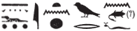

## Esna 192 {-}  
  
  
- Location: Column F, Base  
- Date: Domitian  
- [Hieroglyphic Text](https://www.ifao.egnet.net/uploads/publications/enligne/Temples-Esna002.pdf#page=386){target="_blank"}  
- Bibliography: None  
  
  
  
## Esna 192 A {-}  

  
  
^A^ *ʿnḫ nṯr nfr  *  
*šzp wȝ.t m ḥtp   *  
  *r ḥw.t-ẖnmw  *  
*r [...]  *  
  *n ỉt=f  *  
*[nb]-ḫʿ.w  *  
*([...]) *  
  
^A^ Live the good god,    
who takes up the path in peace  
   to the Temple of Knum,  
in order to [...]  
   for his father.  
[Lord] of Appearances,  
([Domitian Caesar])  

  
  
## Esna 192 B {-}  

  
  
^B^ *nsw.t-bỉty  *  
*ḥwnw nfr  *  
*qmȝ m ḥȝ.t  *  
*ḫy wr nfr-ḥr  *  
*ṯḥn ỉtn wr   *  
  *n mȝȝ(?)=f  *  
*ḫy[...]  *  
*wbn m Nwn  *  
*zȝ ḥqȝ(.t) wsr.t  *  
*rnpỉ wr ḥr-ỉb [...]  *  
   
^B^ King of Upper and Lower Egypt  
good youth,  
created in the beginning,  
great child, beautiful of face,  
   the great disk shines   
       from seeing(?)[^fn-192-1] him.  
child [..]  
who rises from Nun,  
son of the mighty ruler  
great young man within [...]  
  

  
  
[^fn-192-1]: {width=20%}: It would hardly make sense that the sundisk is afraid of the youthful king. The present suggestion is only tentative.  
