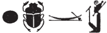
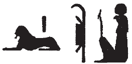
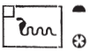
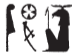
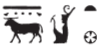
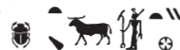

# Notable Spellings {-} 
  
  

<!--made it so far through around 70; long way to go -->

*ỉs*, *ỉsṯ*, "meanwhile"  
  
{width=6%} - [Esna 58], 6  
  
{width=8%} - [Esna 59], 2

*Itm*, "Atum"  
  
{width=16%} - [Esna 54], 12; [Esna 67], 12; [Esna 163], 13   
  
*ʿš*, "to call"
  
{width=10%} - [Esna 59], 1
  
*wbn*, "to rise; shine"  

{width=10%} - [Esna 60], 4
  
{width=18%} - [Esna 169], 5
  
*Wsỉr*, "Osiris" 

{width=16%} - [Esna 81], 3; [Esna 110], 7; [Esna 163], 20  
  
{width=18%} - [Esna 147]  

{width=9%} - [Esna 58], 5

  
*wṯz*, "to raise up"  
  
{width=13%} - [Esna 169], 1  

  
*wḏȝ.ty*, "the wedjat-eyes"  

{width=20%} - [Esna 169], 8

*Mḥ.t-wr.t*, "Mehet-weret"  
  
{width=16%} - [Esna 58], 2

*nb*, "lord; all"  
  
{width=7%} - [Esna 53]; [Esna 76], 15; [Esna 103], 1, 2, 3; [Esna 191], 21.  

  
*nb wʿ*, "the Sole Lord (Re)"  

{width=12%} - [Esna 64], 3
 

*Rʿ*, "Re"  
  
{width=12%} - [Esna 155], 1; [Esna 184], 27; [Esna 191], 3

*ḥw.t-ỉt*, "Temple of the Father"  
  
{width=11%} - [Esna 56]

*ẖnmw*, "Khnum"   
  
{width=18%} - [Esna 54], 7  
  
{width=15%} - [Esna 190], 7  
  
{width=20%} - [Esna 169], 2; [Esna 183], 1.

{width=08%} - [Esna 56]  
  

*sḥḏ*, "to illumine"  
  
{width=8%} - [Esna 53]  

{width=7%} - [Esna 74], 28  
  
{width=7%} - [Esna 164 A]

{width=8%} - [Esna 103]. 3 

*šw*, "Shu"  

{width=15%} - [Esna 156], 25  
  
{width=15%} - [Esna 96], 2
  
*šps*, "august"  
  
{width=6%} - [Esna 59], 1
  
*šm*, "to go"  
  
{width=8%} - [Esna 60], 5

*tȝ-sn.t*, "Esna"  
  
{width=12%} - [Esna 52], 20  

{width=17%} - [Esna 54], 7 
  
{width=13%} - [Esna 96], 2  
  
{width=20%} - [Esna 102], 1  
  
{width=22%} - [Esna 76], 15
  
{width=21%} - [Esna 81], 2  
  
{width=14%} - [Esna 94]

*tȝ-ṯnn N.t*, "Tatenen Neith" (palindrome)

{width=24%} - [Esna 63], 3; [Esna 104], 4  

*tfn.t*, "Tefnut"   
  
{width=5%} - [Esna 60], 1  

{width=8%} - [Esna 60], 5  

{width=22%} - [Esna 60], 3  

*tmdỉʿns nty-ḫwỉ*, "Domitian Augustus" 

{width=24%} - [Esna 59], 1