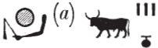
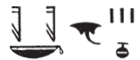
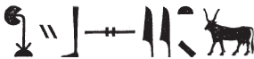
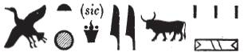
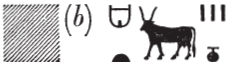
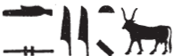

# Bull Text {-}

#### Imn-Ra

1. xw.w {width=10%}: 156, 23

#### itn-m-hrw=f

1. sxn.wy {width=10%}: 156, 22

#### wtT-bA(?) (reading uncertain)

1. Damaged: 156, 22

#### bAbA (Bebon)

1. hb.w {width=10%}: 156, 22

#### PtH

1. bhA.w {width=10%}: 156, 22

#### PtH iri-tA

1. wr.w {width=10%}: 156, 22-23

#### Mr.t nb.t Hz.w

1. nfr-imA.t {width=10%}: 156, 23

#### N.t

1. nty.w(?) {width=10%}: 156, 22

#### NHb-kA.w

1. sAH.w {width=10%}: 156, 22

#### nTr[...]

1. xbsy.w {width=10%}: 156, 23

#### Hr-Ax-bi.t

1. pA-txy.t(?) {width=10%}: 156, 23

#### Hqs

1. Ssty.t (?; Sauneron, Esna II, p. xxxx for reading)  {width=10%}: 156, 23

#### xfA-br.wy

1. [....]-id.t {width=10%}: 156, 23

#### xnty-Tnn.t

1. Spsy.w {width=10%}: 156, 22

#### sHD-wr

1. Sby.w {width=10%}: 156, 22

#### sxt-Szp=f 

1. Ssp.w {width=10%}: 156, 22 (pun on divine name)

#### Sw tfn.t

1. Hby.w(?) {width=10%}: 156, 22

#### dwA-mw.t=f

1. dsy.t {width=10%}: 156, 23

#### Damaged

1. Sms.w {width=10%}: 156, 22

## Uncertain {-}
sAH m [...]

1. ray.t {width=10%}: 156, 23